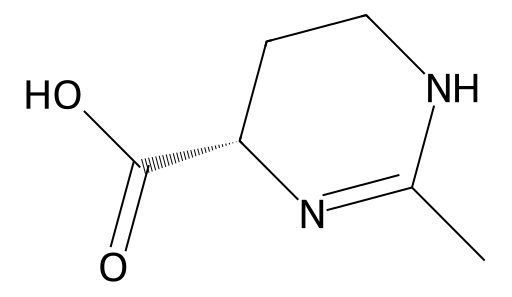

<!-- markdownlint-disable MD025 MD033 MD060 -->
# 依克多因（Ectoin）

- [返回首页](../README.md)
- [1. 常见别名、物理性质、CAS编号、溶解度](#1-常见别名物理性质cas编号溶解度)
- [2. 化学性质、光热稳定性](#2-化学性质光热稳定性)
- [3. 生化特性](#3-生化特性)
- [4. 适应症、药理毒理](#4-适应症药理毒理)
- [5. 药代动力学、起效时间](#5-药代动力学起效时间)
- [6. 常见剂量、给药方式](#6-常见剂量给药方式)
- [7. 副作用、药物过量](#7-副作用药物过量)
- [8. 同分异构体与类似物](#8-同分异构体与类似物)
- [9. 在人体内整体作用](#9-在人体内整体作用)
- [10. 内分泌相关激素](#10-内分泌相关激素)
- [11. 对脂肪代谢](#11-对脂肪代谢)
- [12. 对血压的作用](#12-对血压的作用)
- [13. 对消化系统（急性）](#13-对消化系统急性)
- [14. 对神经系统的调节](#14-对神经系统的调节)
- [15. 对生殖系统](#15-对生殖系统)
- [16. 对皮肤的作用](#16-对皮肤的作用)
- [17. 过多或不足时的治疗](#17-过多或不足时的治疗)
- [18. 中医八纲辨证与五行归经](#18-中医八纲辨证与五行归经)

## 1. 常见别名、物理性质、CAS编号、溶解度

- 中文名：依克多因
- 英文名：Ectoin
- 化学名称：1,4,5,6-四氢-2-甲基-4-吡咯甲酸
- 分子式：C₆H₁₀N₂O₂
- 分子量：142.15
- CAS 号：96702-03-3
- 结构特点：四元环内酰胺结构，属天然环状氨基酸衍生物
- 常见别名：四氢甲基嘧啶羧酸、四氢吡咯甲酸
- 外观：白色或类白色结晶性粉末，无臭，略有咸味
- 熔点：约 280 °C（分解）
- 溶解度
  - 水：高溶解性（约 500 mg/mL）
  - 乙醇：轻微溶解
  - 丙二醇、甘油：良好溶解
  - 油相（如矿物油、硅油）：基本不溶

## 2. 化学性质、光热稳定性

- 化学性质：中性分子，稳定，不参与强氧化还原反应；对酸碱及盐离子耐受力高
- 光热稳定性：优异，耐高温（可耐 80–90 °C 以上），在紫外线照射下结构稳定，不易分解
- 与金属离子：能轻微络合二价金属离子（如Ca²⁺、Mg²⁺）

## 3. 生化特性

- 来源于嗜盐细菌（Halomonas elongata 等）的一种“兼容溶质”，可维持细胞渗透平衡与蛋白质稳定
- 在哺乳动物组织中表现为
  - 保护蛋白质、DNA、细胞膜免受氧化与热应激损伤
  - 稳定角质细胞膜与皮肤屏障
  - 抑制炎症因子（IL-1β、TNF-α）表达

## 4. 适应症、药理毒理

- 药理作用
  - 抗炎（通过抑制NF-κB通路）
  - 抗氧化（减少ROS生成）
  - 稳定黏膜屏障（鼻腔、皮肤、角膜）
  - 调节细胞渗透压、促进细胞存活
- 毒理学
  - LD₅₀ ＞ 2 g/kg（小鼠口服）
  - 无致突变性、无致癌性、无致畸作用

## 5. 药代动力学、起效时间

- 多用于局部外用（喷雾、凝胶、眼液、乳液），不经口系统吸收
- 局部生物利用度：< 1%（主要停留于角质层或黏膜表面）
- 起效时间：数分钟至 30 分钟（主要是保湿、抗刺激感出现）

## 6. 常见剂量、给药方式

- 皮肤外用浓度：0.2 – 2 %（护肤品常见）
- 眼药水/鼻喷剂浓度：0.5 – 2 %
- 口腔喷雾/咽喉含漱液：约 1 %
- 使用频率：每日 2–4 次外用
- 无全身给药制剂

## 7. 副作用、药物过量

- 常见副作用：罕见；极少数人出现轻微刺痒或短暂灼热
- 过量：皮肤过饱和使用无系统性毒性，冲洗即可

## 8. 同分异构体与类似物

- 主要类似物：Hydroxyectoin（羟基依克多因）
  - 水溶性更高，保湿更强
  - 抗UV及抗红外热损伤能力更强
  - 对角膜上皮修复有更佳效果
- 同分异构体意义不大（环状构型固定）

## 9. 在人体内整体作用

- 作为“细胞保护因子”，对皮肤、呼吸道、泪膜、肠黏膜具有膜稳定和抗炎功能
- 不干扰激素、神经或免疫系统的核心调节

## 10. 内分泌相关激素

- 无直接影响睾酮、雌激素、皮质醇等激素水平
- 仅通过减少炎症应激间接降低皮质醇升高趋势

## 11. 对脂肪代谢

- 无直接代谢调节作用，但可改善细胞抗氧化能力，减轻脂质过氧化反应

## 12. 对血压的作用

- 无血管扩张或收缩作用。局部使用不影响血压

## 13. 对消化系统（急性）

- 外用无影响；口服摄入（实验动物）对胃肠道无刺激或毒性反应

## 14. 对神经系统的调节

- 不透过血脑屏障；无中枢神经影响
- 可缓解外周感觉神经刺激（镇静、抗敏）

## 15. 对生殖系统

- 无生殖毒性或激素样作用
- 安全用于敏感部位皮肤、外生殖器护肤制剂中

## 16. 对皮肤的作用

- 主要作用部位：角质层
- 作用机制
  - 提高皮肤含水量（保湿能力提升 50–60%）
  - 减少紫外诱导的红斑与DNA损伤
  - 减轻刺激性皮炎、特应性皮炎反应
  - 提升皮肤屏障蛋白（filaggrin、claudin-1）表达
- 效果特征：快速缓解刺痛与干燥，持续数小时

## 17. 过多或不足时的治疗

- 过多使用：无需特殊处理；冲洗即可
- 不足（皮肤屏障损伤、干燥炎症）时常用替代或辅助药物
  - 泛醇（维生素B₅）
  - 透明质酸钠
  - 神经酰胺
  - 甘油
  - 非孕女性同用药无差异

## 18. 中医八纲辨证与五行归经

- 性质：微寒、甘，入肺、脾、皮部
- 功效类比：益阴生津、润肤解毒、护气化津
- 八纲：属“阴性平补”，无寒热偏性
- 五行归经：主入肺经、脾经，次入皮腠（卫气层）
- 中医应用比拟：用于“皮燥、津伤、风热红肿、鼻干咽燥”等证
