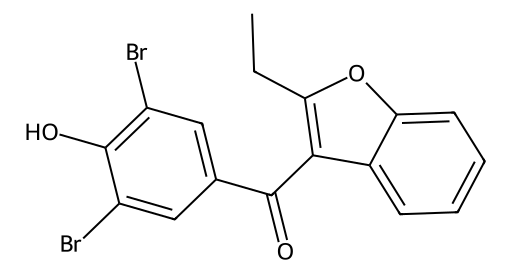

<!-- markdownlint-disable MD025 MD033 MD060 -->
# 苯溴马隆（Benzbromarone）

- [返回首页](../README.md)
- [1. 常见别名、物理性质、CAS编号、溶解度](#1-常见别名物理性质cas编号溶解度)
- [2. 化学性质、光热稳定性](#2-化学性质光热稳定性)
- [3. 生化特性](#3-生化特性)
- [4. 适应症、药理毒理](#4-适应症药理毒理)
- [5. 药代动力学、起效时间](#5-药代动力学起效时间)
- [6. 常见剂量、给药方式](#6-常见剂量给药方式)
- [7. 副作用、药物过量](#7-副作用药物过量)
- [8. 同分异构体与类似物](#8-同分异构体与类似物)
- [9. 在人体内整体作用](#9-在人体内整体作用)
- [10. 内分泌相关激素](#10-内分泌相关激素)
- [11. 对脂肪代谢](#11-对脂肪代谢)
- [12. 对血压的作用](#12-对血压的作用)
- [13. 对消化系统（急性）](#13-对消化系统急性)
- [14. 对神经系统的调节](#14-对神经系统的调节)
- [15. 对生殖系统](#15-对生殖系统)
- [16. 对皮肤的作用](#16-对皮肤的作用)
- [17. 过多或不足时的治疗](#17-过多或不足时的治疗)
- [18. 中医八纲辨证与五行归经](#18-中医八纲辨证与五行归经)

## 1. 常见别名、物理性质、CAS编号、溶解度

> 溴苯马龙是一种强效促尿酸排泄药，对“尿酸排泄减少型痛风”尤为有效  
> 最大限制是潜在严重肝毒性，临床使用必须严格监测肝功能

- 常见别名：苯溴马龙、Benzbromarone
- CAS号：3562-84-3
- 分子式：C17H12Br2O3
- 分子量：424.09
- 白色或类白色结晶性粉末
- 熔点：约155–158°C
- 脂溶性较高（logP≈5）
- 溶解度
  - 水中：极难溶
  - 有机溶剂：易溶于乙醇、氯仿、二甲基亚砜

## 2. 化学性质、光热稳定性

- 含二溴取代芳环，疏水性强
- 酚羟基可发生弱酸性反应
- 光稳定性较差：紫外光下易降解
- 热稳定性中等：高温可分解

## 3. 生化特性

- 强效尿酸转运蛋白抑制剂（URAT1抑制）
- 主要作用于肾近曲小管
- 抑制尿酸重吸收 → 促进尿酸排泄

## 4. 适应症、药理毒理

- 适应症
  - 高尿酸血症
  - 痛风（尤其排泄减少型）
- 药理作用
  - 显著降低血尿酸水平
  - 对黄嘌呤氧化酶无抑制作用（区别于别嘌醇）
- 毒理特点
  - 肝毒性是核心风险（可致严重肝损伤甚至死亡）
  - 具有剂量依赖性与个体差异

## 5. 药代动力学、起效时间

- 吸收：口服吸收良好
- 蛋白结合率：>95%
- 代谢：肝脏（CYP450，主要CYP2C9）
- 半衰期：约3–10小时（活性代谢物更长）
- 起效时间
  - 24–48小时开始降低尿酸
  - 1–2周达稳定效果

## 6. 常见剂量、给药方式

- 口服
- 常用剂量
  - 初始：25 mg/日
  - 常规：50–100 mg/日

## 7. 副作用、药物过量

- 常见副作用
  - 肝功能异常（转氨酶升高）
  - 胃肠不适
  - 皮疹
- 严重不良反应
  - 暴发性肝坏死
  - 胆汁淤积性肝炎
- 过量表现
  - 严重肝毒性
  - 恶心、呕吐、乏力

## 8. 同分异构体与类似物

- 类似药物
  - 丙磺舒（Probenecid）：尿酸排泄促进
  - 非布司他（Febuxostat）：抑制尿酸生成
- 比较
  - 溴苯马龙：排泄增强
  - 别嘌醇/非布司他：生成抑制

## 9. 在人体内整体作用

- 降低血尿酸 → 减少尿酸盐结晶
- 减少关节炎发作
- 长期改善痛风石

## 10. 内分泌相关激素

- 对性激素无直接影响
- 但可能间接影响：胰岛素敏感性（轻微改善）

## 11. 对脂肪代谢

- 无显著直接作用
- 降尿酸可能改善代谢综合征部分指标

## 12. 对血压的作用

- 轻度降压趋势（通过改善内皮功能）
- 非主要降压药

## 13. 对消化系统（急性）

- 胃刺激
- 恶心、腹痛

## 14. 对神经系统的调节

- 无直接中枢作用
- 间接影响：高尿酸降低 → 减少炎症性神经痛

## 15. 对生殖系统

- 无明显直接作用
- 长期高尿酸改善 → 可能间接改善血管性勃起功能

## 16. 对皮肤的作用

- 可出现药疹
- 痛风结节逐渐减少

## 17. 过多或不足时的治疗

- 高尿酸治疗药物选择
  - 排泄型：溴苯马龙、丙磺舒
  - 生成抑制型：别嘌醇、非布司他
- 男性 vs 非孕女性差异
  - 男性更常见高尿酸 → 更常用
  - 女性（非孕）：同样可用，但剂量更谨慎肝，毒性风险相似

## 18. 中医八纲辨证与五行归经

- 八纲辨证：属“湿热下注”“痰瘀阻络”
- 五行归经：归肝、肾经
- 作用理解：类似“利湿泄浊、通络止痛”
