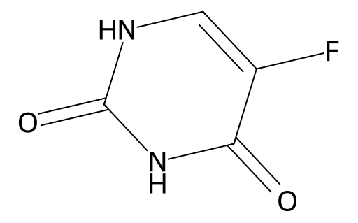

<!-- markdownlint-disable MD025 MD033 MD060 -->
# 5-氟尿嘧啶（5-FU）

- [返回首页](../README.md)
- [1. 常见别名、物理性质、CAS编号、溶解度](#1-常见别名物理性质cas编号溶解度)
- [2. 化学性质、光热稳定性](#2-化学性质光热稳定性)
- [3. 生化特性](#3-生化特性)
- [4. 适应症、药理毒理](#4-适应症药理毒理)
- [5. 药代动力学、起效时间](#5-药代动力学起效时间)
- [6. 常见剂量、给药方式](#6-常见剂量给药方式)
- [7. 副作用、药物过量](#7-副作用药物过量)
- [8. 同分异构体与类似物](#8-同分异构体与类似物)
- [9. 在人体内整体作用](#9-在人体内整体作用)
- [10. 内分泌相关激素](#10-内分泌相关激素)
- [11. 对脂肪代谢](#11-对脂肪代谢)
- [12. 对血压的作用](#12-对血压的作用)
- [13. 对消化系统（急性）](#13-对消化系统急性)
- [14. 对神经系统的调节](#14-对神经系统的调节)
- [15. 对生殖系统](#15-对生殖系统)
- [16. 对皮肤的作用](#16-对皮肤的作用)
- [17. 过多或不足时的治疗](#17-过多或不足时的治疗)
- [18. 中医八纲辨证与五行归经](#18-中医八纲辨证与五行归经)

## 1. 常见别名、物理性质、CAS编号、溶解度

- 常见别名：5-氟尿嘧啶，5-Fluorouracil，5-FU，氟尿嘧啶，Fluorouracil，FU
- CAS编号：51-21-8
- 分子式：C4H3FN2O2
- 分子量：130.08
- 外观：白色或类白色结晶性粉末
- 熔点：约282–286°C（分解）
- 溶解度
  - 微溶于水
  - 在碱性环境中溶解度升高
  - 微溶于乙醇
  - 几乎不溶于氯仿  - 乙醚
- pKa：约7.9
- LogP：−0.8左右，亲水性较高

## 2. 化学性质、光热稳定性

- 属于氟代嘧啶类抗代谢药
- 结构上是
  - 尿嘧啶5位氢原子被氟取代
- 其毒性和药理活性来源于
  - “伪装”为正常嘧啶碱基
  - 干扰DNA/RNA合成
- 稳定性
  - 常温较稳定
  - 避光保存
  - 水溶液长期放置会缓慢降解
  - 高温下分解
  - 紫外线可促进降解
- 配伍注意
  - 存在不稳定风险
  - 强碱
  - 强氧化剂

## 3. 生化特性

- 5-FU属于典型：S期特异性细胞毒药物
- 进入细胞后转化为
  - FdUMP
  - FUTP
  - FdUTP
- 核心机制：抑制胸苷酸合成酶（TS）
- FdUMP与TS形成稳定复合物
  - dUMP \xrightarrow{TS} dTMP
  - 导致：dTMP缺乏，DNA复制停止，DNA断裂
- RNA掺入
  - FUTP可进入RNA
  - 干扰mRNA加工
  - 干扰核糖体功能
- DNA错误掺入
  - FdUTP掺入DNA
  - 导致DNA损伤
  - 激活凋亡

## 4. 适应症、药理毒理

- 常见适应症
  - 结直肠癌
  - 胃癌
  - 胰腺癌
  - 食管癌
  - 乳腺癌
  - 头颈部肿瘤
  - 肛管癌
- 外用
  - 日光性角化病
  - 基底细胞癌
  - 尖锐湿疣（部分国家）
- 药理特点
  - 抗增殖
  - 高度抑制快速分裂细胞
- 毒理特点（高度毒性）
  - 骨髓
  - 胃肠道
  - 毛囊
  - 生殖细胞

## 5. 药代动力学、起效时间

- 给药方式
  - 静脉推注
  - 持续静滴
  - 外用乳膏
- 生物利用度，口服极差
  - 首过代谢严重
  - 个体差异极大
  - 抑制DPD后可直接吸收
- 半衰期
  - 血浆半衰期极短：10–20分钟
  - 活性代谢物细胞内持续时间较长
- 代谢
  - 二氢嘧啶脱氢酶（DPD）代谢灭活
- DPD缺陷者可发生
  - 致死性毒性
- 排泄
  - 尿排泄为主
  - 部分呼出CO2

## 6. 常见剂量、给药方式

- 静脉方案：肿瘤方案差异极大
  - 400–600 mg/m² bolus
  - 或持续输注1000–3000 mg/m²
- 外用
  - 5%乳膏：每日1–2次

## 7. 副作用、药物过量

- 常见副作用
  - 骨髓抑制：白细胞下降，血小板下降，贫血
  - 胃肠毒性：严重口腔炎，腹泻，恶心，肠黏膜脱落
  - 皮肤毒性：手足综合征，色素沉着，光敏感
  - 神经毒性（少见）：小脑综合征，意识障碍
  - 心脏毒性（偶见）：冠脉痉挛，心绞痛心律失常
- 过量表现
  - 急性：暴发性骨髓抑制，严重腹泻，消化道出血，感染性休克
  - 延迟：全血细胞减少，多器官衰竭
- 解毒
  - 尿苷三乙酸（Uridine triacetate）

## 8. 同分异构体与类似物

- 卡培他滨（Capecitabine）
  - 口服前药
  - 肿瘤组织选择性转化为5-FU
- 替加氟（Tegafur）
  - 缓释型前药
- S-1
  - 包含：替加氟，DPD抑制剂，胃肠毒性调节剂
- 氟尿苷（Floxuridine）
  - 更偏向DNA方向毒性

## 9. 在人体内整体作用

- 5-FU会优先攻击
  - 高增殖组织
- 因此全身表现为
  - 骨髓抑制
  - 消化道黏膜破坏
  - 生殖抑制
  - 毛发脱落
- 长期可导致
  - 免疫低下
  - 营养障碍
  - 生育能力下降

## 10. 内分泌相关激素

- 5-FU本身不是激素药
- 可间接影响
  - 睾酮：生精损伤后可能继发下降
  - LH/FSH：生精障碍后FSH可能升高
  - 皮质醇：应激状态可升高

## 11. 对脂肪代谢

- 间接影响
  - 食欲下降
  - 肠吸收下降
  - 恶病质
- 导致
  - 脂肪减少
  - 体重下降
- 肝脂代谢（少数）
  - 少数可致
  - 脂肪肝
  - 肝线粒体损伤

## 12. 对血压的作用

- 通常无直接降压作用
- 但可因
  - 脱水
  - 感染
  - 心功能异常
- 导致
  - 低血压
- 冠脉痉挛时
  - 可诱发高血压反应

## 13. 对消化系统（急性）

- 这是5-FU最主要毒性之一
- 早期
  - 恶心
  - 呕吐
  - 食欲下降
- 中后期
  - 黏膜炎
  - 严重腹泻
  - 肠上皮坏死
- 严重时
  - 肠穿孔
  - 脓毒症

## 14. 对神经系统的调节

- 机制，可能涉及
  - RNA代谢障碍
  - 髓鞘损伤
  - 高氨血症
- 表现
  - 共济失调
  - 认知障碍
  - 嗜睡
  - 小脑毒性
- 罕见但可能严重

## 15. 对生殖系统

- 男性，可导致
  - 精原细胞损伤
  - 少精
  - 无精
  - 精子DNA损伤
- 长期大剂量
  - 可能影响生育力
- 女性
  - 卵泡损伤
  - 月经紊乱

## 16. 对皮肤的作用

- 常见
  - 手足综合征
  - 红斑
  - 色素沉着
- 外用时
  - 炎症
  - 糜烂
  - 结痂
- 这是治疗机制的一部分

## 17. 过多或不足时的治疗

- 过量处理
  - 尿苷三乙酸
  - G-CSF
  - 输血
  - 广谱抗生素
  - 肠外营养
- 女性非孕期
  - 支持治疗原则基本一致
- 但女性更关注
  - 卵巢储备
  - 生育保护
- 有时提前
  - 冷冻卵子
  - GnRH激动剂保护

## 18. 中医八纲辨证与五行归经

- 八纲：热毒，阴伤，气血两虚
- 归经：脾，胃，肝，肾
- 常见证候：胃阴受损，热毒伤津，气阴两虚，肾精亏损
- 中医支持思路：健脾益气，养阴生津，凉血解毒
