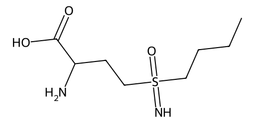

<!-- markdownlint-disable MD025 MD033 MD060 -->
# 丁硫氨酸亚砜胺（BSO）

- [返回首页](../README.md)
- [1. 常见别名、物理性质、CAS编号、溶解度](#1-常见别名物理性质cas编号溶解度)
- [2. 化学性质、光热稳定性](#2-化学性质光热稳定性)
- [3. 生化特性](#3-生化特性)
- [4. 适应症、药理毒理](#4-适应症药理毒理)
- [5. 药代动力学、起效时间](#5-药代动力学起效时间)
- [6. 常见剂量、给药方式](#6-常见剂量给药方式)
- [7. 副作用、药物过量](#7-副作用药物过量)
- [8. 同分异构体与类似物](#8-同分异构体与类似物)
- [9. 在人体内整体作用](#9-在人体内整体作用)
- [10. 内分泌相关激素](#10-内分泌相关激素)
- [11. 对脂肪代谢](#11-对脂肪代谢)
- [12. 对血压的作用](#12-对血压的作用)
- [13. 对消化系统（急性）](#13-对消化系统急性)
- [14. 对神经系统的调节](#14-对神经系统的调节)
- [15. 对生殖系统](#15-对生殖系统)
- [16. 对皮肤的作用](#16-对皮肤的作用)
- [17. 过多或不足时的治疗](#17-过多或不足时的治疗)
- [18. 中医八纲辨证与五行归经](#18-中医八纲辨证与五行归经)

> 丁硫氨酸亚砜胺（Buthionine Sulfoximine，BSO）是一种实验研究中常用的谷胱甘肽（GSH）耗竭剂，并非临床批准药物  
> 其主要作用是不可逆抑制γ-谷氨酰半胱氨酸合成酶（γ-glutamylcysteine synthetase，GCLC），从而阻断谷胱甘肽合成  
> 丁硫氨酸亚砜胺（BSO）最核心的生物学意义是通过不可逆抑制GCLC，使细胞谷胱甘肽（GSH）耗竭，从而增强氧化应激并诱导铁死亡  
> 它广泛用于肿瘤、铁死亡、神经退行性疾病和生殖毒性研究，但不是临床常规用药  
> 对于男性生殖系统而言，长期或高剂量暴露可损害精子发生和睾丸抗氧化防御能力  

## 1. 常见别名、物理性质、CAS编号、溶解度

- 别名：Buthionine Sulfoximine、BSO、DL-Buthionine-(S,R)-sulfoximine、L-Buthionine-(S,R)-sulfoximine、丁硫氨酸亚砜亚胺（更准确译名）
- CAS号
  - DL型：5072-26-4
  - L型：83730-53-4  
- 分子式：C₈H₁₈N₂O₃S
- 分子量：222.31 g/mol
- 白色结晶或粉末状固体
- 溶解度
  - 水：25–50 mg/mL
  - 极性有机溶剂中可溶
  - 在脂溶性有机溶剂中的溶解度较低

## 2. 化学性质、光热稳定性

- 属于亚砜亚胺（Sulfoximine）类化合物
- 特点
  - 含有S(=O)(=NH)官能团
  - 在生理pH下较稳定
  - 不易发生氧化还原反应
- 常温稳定
- 推荐2–8℃保存
- 干粉状态稳定数月至数年
- 水溶液长期放置可缓慢降解

## 3. 生化特性

- 核心机制
  - 抑制GCLC =>
  - 谷胱甘肽合成减少 =>
  - 细胞抗氧化能力下降 =>
  - ROS升高 =>
  - 氧化应激增加 =>
  - 诱导铁死亡（Ferroptosis）
- BSO是研究铁死亡最经典的工具化合物之一

## 4. 适应症、药理毒理

- 临床适应症
- 研究用途
  - 肿瘤化疗增敏
  - 放疗增敏
  - 铁死亡研究
  - 氧化应激研究
  - 谷胱甘肽耗竭模型建立
- 主要毒性来源
  - 氧化损伤
  - 线粒体损伤
  - 神经毒性
  - 肝毒性
  - 肾毒性

## 5. 药代动力学、起效时间

- 人体资料有限
- 起效
  - 数小时开始降低GSH
  - 12–24小时出现明显耗竭
- 持续时间
  - 24–72小时
- 由于对酶的抑制接近不可逆，恢复依赖新酶合成

## 6. 常见剂量、给药方式

- 动物实验常见
  - 腹腔注射
  - 静脉注射
  - 灌胃
- 常用剂量
  - 50–500 mg/kg
- 人体研究曾探索
  - 数百mg/m²至数g/m²静脉输注
  - 但未形成标准治疗方案

## 7. 副作用、药物过量

- 常见副作用
  - 恶心
  - 呕吐
  - 食欲下降
  - 疲劳
  - 头痛
- 严重不良反应
  - 肝损伤
  - 经损伤
  - 髓抑制
  - 痫发作（极高剂量）
- 过量机制，GSH过度耗竭导致
  - ROS暴增
  - 脂质过氧化
  - 细胞死亡
- 解救措施
  - N-乙酰半胱氨酸（NAC）
  - 谷胱甘肽补充
  - 抗氧化剂治疗

## 8. 同分异构体与类似物

- 光学异构体
  - L-BSO
  - D-BSO
  - DL-BSO
  - L-BSO活性最高
- 类似物
  - N-乙酰半胱氨酸（NAC），作用相反：提高GSH、抗氧化
  - Erastin：铁死亡诱导剂、抑制System Xc⁻
  - RSL3：GPX4抑制剂、强效铁死亡诱导剂

## 9. 在人体内整体作用

- 抗氧化能力下降：GSH储备耗竭
- 氧化应激增强：ROS累积
- 铁死亡敏感性提高
- 化疗增敏，对部分肿瘤细胞：顺铂、美法仑、多柔比星敏感性增加

## 10. 内分泌相关激素

- 无直接受体作用
- 间接影响
  - 睾酮
  - 皮质醇
  - 胰岛素
- 原因是氧化应激会影响内分泌细胞功能
- 长期GSH耗竭
  - Leydig细胞功能下降
  - 睾酮合成可能减少

## 11. 对脂肪代谢

- 通过ROS介导
  - 脂质过氧化增加
  - 脂肪酸氧化增强
  - 膜脂损伤增加
- 铁死亡过程中尤为明显

## 12. 对血压的作用

- 无直接降压或升压作用
- 但严重氧化应激时可出现
  - 内皮功能障碍
  - NO生成减少
  - 血压轻度升高倾向

## 13. 对消化系统（急性）

- 可能出现
  - 恶心
  - 呕吐
  - 腹痛
  - 腹泻
- 机制与胃肠黏膜氧化损伤有关

## 14. 对神经系统的调节

- 神经元高度依赖GSH
- BSO可导致
  - 神经元ROS升高
  - 线粒体损伤
  - 谷氨酸兴奋毒性增强
- 实验中常用于
  - 帕金森病模型
  - 神经退行性疾病模型

## 15. 对生殖系统

> 这是其较重要的研究方向

- 睾丸
  - GSH是睾丸最重要抗氧化体系之一
- BSO可导致
  - 精原细胞损伤
  - 精子数量下降
  - 精子DNA损伤
  - 生精障碍
- Leydig细胞，长期高剂量
  - 睾酮下降
  - 类低雄激素状态
- 动物实验中可出现
  - 睾丸重量下降
  - 精子活力下降

## 16. 对皮肤的作用

- 理论上
  - 减少黑色素细胞抗氧化能力
  - 增加光损伤
- 但不作为皮肤药物应用

## 17. 过多或不足时的治疗

- 过量
  - NAC
  - 谷胱甘肽
  - 维生素C
  - 维生素E
- GSH不足状态
  - 男性和非孕期女性治疗原则基本一致
  - N-乙酰半胱氨酸
  - 谷胱甘肽
  - α-硫辛酸
  - 维生素C

## 18. 中医八纲辨证与五行归经

- 八纲：偏热证，偏实证，因为其促进氧化应激和组织损伤
- 五行归属：肝、肾
- 可能表现：肝阴受损，肾精受损，虚火内生
- 中医角度可对应：肝肾阴虚，阴虚火旺
