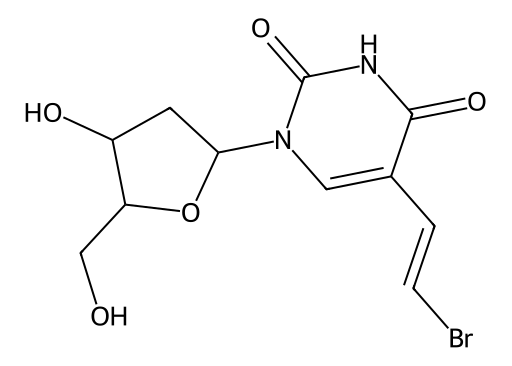

<!-- markdownlint-disable MD025 MD033 MD060 -->
# 立夫拉定（BVDU）

- [返回首页](../README.md)
- [1. 常见别名、物理性质、CAS编号、溶解度](#1-常见别名物理性质cas编号溶解度)
- [2. 化学性质、光热稳定性](#2-化学性质光热稳定性)
- [3. 生化特性](#3-生化特性)
- [4. 适应症、药理毒理](#4-适应症药理毒理)
- [5. 药代动力学、起效时间](#5-药代动力学起效时间)
- [6. 常见剂量、给药方式](#6-常见剂量给药方式)
- [7. 副作用、药物过量](#7-副作用药物过量)
- [8. 同分异构体与类似物](#8-同分异构体与类似物)
- [9. 在人体内整体作用](#9-在人体内整体作用)
- [10. 内分泌相关激素](#10-内分泌相关激素)
- [11. 对脂肪代谢](#11-对脂肪代谢)
- [12. 对血压的作用](#12-对血压的作用)
- [13. 对消化系统（急性）](#13-对消化系统急性)
- [14. 对神经系统的调节](#14-对神经系统的调节)
- [15. 对生殖系统](#15-对生殖系统)
- [16. 对皮肤的作用](#16-对皮肤的作用)
- [17. 过多或不足时的治疗](#17-过多或不足时的治疗)
- [18. 中医八纲辨证与五行归经](#18-中医八纲辨证与五行归经)

> Brivudine（布立夫定、溴夫定、Brivudin、BVDU）是一种胸苷类似物抗病毒药，主要用于治疗带状疱疹，尤其是早期的Herpes Zoster
> 其最大特点并不是抗病毒本身，而是它与氟尿嘧啶类药物存在“高度致死性相互作用”

## 1. 常见别名、物理性质、CAS编号、溶解度

- 中文名：布立夫定、溴夫定
- 英文名：Brivudine / Brivudin / BVDU
- 化学名：(E)-5-(2-bromovinyl)-2’-deoxyuridine
- CAS：69304-47-8  
- 分子式：C11H13BrN2O5
- 分子量：333.13
- 外观：白色或类白色结晶性粉末
- 对光较敏感
- 溶解性
  - 水中中等溶解
  - 在DMSO、DMF中溶解性较好
  - 在强极性有机溶剂中较稳定

## 2. 化学性质、光热稳定性

- 属于卤代脱氧尿苷类似物
- 在酸性环境下相对稳定
- 碱性条件下逐渐分解
- 光照可导致降解
- 主要代谢产物
  - BVU（Bromovinyluracil，溴乙烯尿嘧啶）
- BVU是关键毒理来源

## 3. 生化特性

- 布立夫定进入感染细胞后
  - 被病毒胸苷激酶磷酸化
  - 转化为三磷酸形式
  - 抑制病毒DNA聚合酶
  - 阻断病毒DNA复制
- 对
  - VZV（水痘-带状疱疹病毒）活性极强
  - HSV-1有效
  - HSV-2作用较弱  

## 4. 适应症、药理毒理

- 布立夫定本身真正危险的地方，是其代谢物BVU会
  - 不可逆抑制DPD（Dihydropyrimidine Dehydrogenase，二氢嘧啶脱氢酶）
- DPD负责代谢
  - Fluorouracil
  - Capecitabine
  - 替加氟
  - 氟胞嘧啶等氟嘧啶类药物
- 因此，若在布立夫定后使用5-FU类药物，会导致
  - 5-FU暴露量暴增
  - 严重骨髓抑制
  - 爆发性黏膜炎
  - 顽固性腹泻
  - 神经毒性
  - 多器官衰竭
  - 死亡
- DPD恢复时间
  - 连续服用7天布立夫定后
  - DPD功能恢复通常需要：至少18天
  - 临床通常要求：与氟嘧啶类药物间隔4周以上  

## 5. 药代动力学、起效时间

- 成人口服后
  - 生物利用度：约30%
  - 达峰时间：1–2小时
  - 血浆半衰期：约16小时
  - 主要经肝脏代谢
  - 肾脏排泄代谢物
- 病毒感染细胞内活性代谢物半衰期较长，因此可每日一次给药。  

## 6. 常见剂量、给药方式

- 成人
  - 125 mg
  - 每日1次
  - 连续7天
- 需尽早使用
  - 最佳窗口：带状疱疹出现72小时内

## 7. 副作用、药物过量

- 常见
  - 恶心
  - 头痛
  - 腹痛
  - 呕吐
  - 轻度肝酶升高
- 罕见
  - 急性肝炎
  - 谵妄
  - 严重骨髓抑制（通常与5-FU联用有关）  
- DPD被抑制后的主观表现
  - > 若DPD严重缺陷或被布立夫定抑制后又接触氟嘧啶类药物，可出现
  - 早期：极度乏力、食欲下降、恶心、口腔灼痛、腹泻
  - 随后：爆发性口腔溃疡、吞咽困难、血便、高热、粒细胞下降、出血倾向
  - 神经系统：意识模糊、谵妄、共济失调、嗜睡
  - 严重时：脓毒症、多器官衰竭

## 8. 同分异构体与类似物

- 索利夫定与布立夫定结构非常接近
  - 都会产生BVU
  - 都抑制DPD
  - 都可与5-FU形成致死联用
  - 日本曾因索利夫定与5-FU联用导致大量死亡病例，引发严重药害事件
  - 布立夫定因此在很多国家受到严格限制。  
- 与其他抗疱疹药比较
  - 相比：Aciclovir、Valaciclovir、Famciclovir
  - 布立夫定：对VZV活性更强，给药更方便（qd），但药物相互作用风险远高于其他药物

## 9. 在人体内整体作用

- 详见下文

## 10. 内分泌相关激素

- 无明显直接激素效应

## 11. 对脂肪代谢

- 无明显直接作用

## 12. 对血压的作用

- 通常无明显影响

## 13. 对消化系统（急性）

- 恶心、腹痛较常见

## 14. 对神经系统的调节

- 可减少疱疹神经炎症
- 少数可致中枢兴奋或谵妄

## 15. 对生殖系统

- 无明确直接毒性
- 但严重5-FU相互作用时可继发性损害生精功能

## 16. 对皮肤的作用

- 暂无信息

# 17. 过多或不足时的治疗

- 暂无信息

## 18. 中医八纲辨证与五行归经

- 八纲辨证：肝胆湿热、火毒蕴结
- 布立夫定：清热解毒、散火毒
