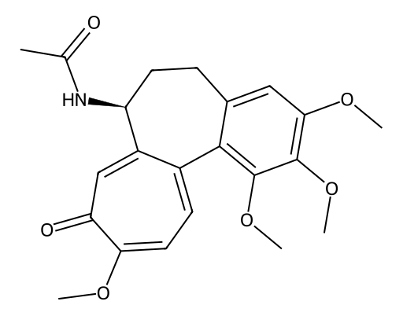

<!-- markdownlint-disable MD025 MD033 MD060 -->
# 秋水仙碱（Colchicine）

- [返回首页](../README.md)
- [1. 常见别名、物理性质、CAS编号、溶解度](#1-常见别名物理性质cas编号溶解度)
- [2. 化学性质、光热稳定性](#2-化学性质光热稳定性)
- [3. 生化特性](#3-生化特性)
- [4. 适应症、药理毒理](#4-适应症药理毒理)
- [5. 药代动力学、起效时间](#5-药代动力学起效时间)
- [6. 常见剂量、给药方式](#6-常见剂量给药方式)
- [7. 副作用、药物过量](#7-副作用药物过量)
- [8. 同分异构体与类似物](#8-同分异构体与类似物)
- [9. 在人体内整体作用](#9-在人体内整体作用)
- [10. 内分泌相关激素](#10-内分泌相关激素)
- [11. 对脂肪代谢](#11-对脂肪代谢)
- [12. 对血压的作用](#12-对血压的作用)
- [13. 对消化系统（急性）](#13-对消化系统急性)
- [14. 对神经系统的调节](#14-对神经系统的调节)
- [15. 对生殖系统](#15-对生殖系统)
- [16. 对皮肤的作用](#16-对皮肤的作用)
- [17. 过多或不足时的治疗](#17-过多或不足时的治疗)
- [18. 中医八纲辨证与五行归经](#18-中医八纲辨证与五行归经)

# 秋水仙碱

> 秋水仙碱（Colchicine）是一种经典微管抑制剂类生物碱，来源于秋水仙属植物

## 1. 常见别名、物理性质、CAS编号、溶解度

- 常见名：秋水仙碱、Colchicine、秋水仙素（旧称）
- CAS号：64-86-8
- 分子式：C₂₂H₂₅NO₆
- 分子量：399.44
- 外观：黄色或黄色针状结晶粉末
- 熔点：约 150–160°C（分解）
- 溶解性
  - 水：微溶（约0.45 mg/mL，25°C）
  - 乙醇：易溶
  - 氯仿/丙酮：易溶
  - 生理盐水：低溶解度
  - 脂溶性中等（较易跨膜）

## 2. 化学性质、光热稳定性

- 属三环生物碱结构（tropolone衍生物）
- 易发生
  - 酸碱环境下结构稳定性较差（强酸/强碱可水解）
  - 光敏性：中等，紫外线可引起降解
  - 热稳定性：中等，加热易分解
- 易与微管蛋白结合（非共价结合）

## 3. 生化特性

- 主要靶点
  - β-微管蛋白（tubulin）
- 作用机制
  - 抑制微管聚合
  - 阻断纺锤体形成
  - 抑制中性粒细胞趋化与吞噬
- 抗炎机制核心
  - 抑制NLRP3炎症小体

## 4. 适应症、药理毒理

- 适应症
  - 急性痛风发作（首选或二线）
  - 家族性地中海热（FMF）
  - 复发性心包炎（部分指南）
- 毒理
  - 治疗窗极窄
  - 强细胞毒性（类似抗有丝分裂药）

## 5. 药代动力学、起效时间

- 吸收：口服吸收良好（约30–50%）
- Tmax：0.5–2小时
- 分布：广泛分布于肝、脾、白细胞
- 半衰期：约 20–40小时（受肝肠循环影响）
- 代谢：肝CYP3A4
- 排泄：胆汁 > 肾脏
- 起效时间
  - 急性痛风：12–24小时开始缓解炎症

## 6. 常见剂量、给药方式

- 急性痛风
  - 首剂1.0 mg，后0.5 mg每1小时或分次
  - 或总量不超过6 mg/疗程（现代更保守）
- 预防痛风
  - 0.5–1.0 mg/日
- FMF
  - 1–2 mg/日分次
- 给药方式
  - 口服为主
  - 静脉注射已基本淘汰（毒性极高）

## 7. 副作用、药物过量

- 常见副作用
  - 胃肠道反应：腹泻、呕吐（最早出现）
  - 肝酶升高
  - 骨髓抑制（长期）
- 过量毒性（三阶段）
  - 胃肠期：剧烈腹泻、脱水
  - 多器官衰竭期：肝肾损伤、心律失常
  - 骨髓抑制期：白细胞/血小板下降、感染死亡风险

## 8. 同分异构体与类似物

- 秋水仙胺（Colcemid）
  - 结构类似，抗有丝分裂更强
- 秋水仙酰胺衍生物
- 微管抑制剂类
  - 长春碱（Vincristine）
  - 紫杉醇（Paclitaxel，机制相反：稳定微管）
- 生化差异
  - 秋水仙碱：阻断聚合
  - 紫杉类：阻止解聚

## 9. 在人体内整体作用

- 抑制先天免疫炎症反应
- 降低中性粒细胞迁移
- 降低尿酸晶体诱导炎症
- 对代谢系统无直接调节作用（非内分泌药）

## 10. 内分泌相关激素

- 无直接激素样作用
- 间接影响
  - 炎症下降 → 皮质醇需求减少（间接）
- 不影响
  - 睾酮、雌激素轴（无直接证据）

## 11. 对脂肪代谢

- 无直接脂肪代谢调节作用
- 高剂量毒性状态可
  - 抑制细胞分裂 → 间接抑制脂肪细胞更新
- 临床不用于减脂

## 12. 对血压的作用

- 一般无直接降压作用
- 毒性期可能
  - 脱水 → 低血压
- 无交感/RAAS调节效应

## 13. 对消化系统（急性）

- 强烈胃肠刺激作用
- 常见
  - 腹痛、腹泻（剂量限制因素）
  - 肠上皮细胞微管抑制 → 吸收功能下降

## 14. 对神经系统的调节

- 不直接作用中枢神经递质
- 可能
  - 周围神经病变（长期或中毒）
- 机制
  - 轴突运输依赖微管 → 被抑制

## 15. 对生殖系统

- 高剂量
  - 抑制精子生成（抗有丝分裂作用）
  - 可逆性生精抑制
- 临床剂量
  - 通常不显著影响性功能

## 16. 对皮肤的作用

- 无治疗性皮肤作用
- 毒性
  - 脱发（细胞分裂抑制）
  - 皮疹（少见）

## 17. 过多或不足时的治疗

- 过量处理
  - 无特效解毒剂
- 支持治疗
  - 活性炭（早期）
  - G-CSF（骨髓抑制）
  - 血液净化（有限效果）
- 不足（痛风控制）
  - NSAIDs（如依托考昔）
  - 糖皮质激素
  - IL-1抑制剂（阿那白滞素）

## 18. 中医八纲辨证与五行归经

- 性味：苦、寒
- 归经：肝、脾、肾（现代对应炎症/代谢轴）
- 八纲：属寒凉解毒、通络止痛，偏里实热证
- 功能对应：清热解毒，破瘀通络
