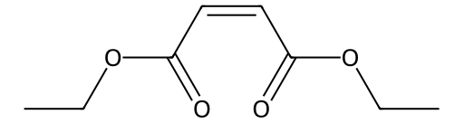

<!-- markdownlint-disable MD025 MD033 MD060 -->
# 二乙基马来酸酯（DEM）

- [返回首页](../README.md)
- [1. 常见别名、物理性质、CAS编号、溶解度](#1-常见别名物理性质cas编号溶解度)
- [2. 化学性质、光热稳定性](#2-化学性质光热稳定性)
- [3. 生化特性](#3-生化特性)
- [4. 适应症、药理毒理](#4-适应症药理毒理)
- [5. 药代动力学、起效时间](#5-药代动力学起效时间)
- [6. 常见剂量、给药方式](#6-常见剂量给药方式)
- [7. 副作用、药物过量](#7-副作用药物过量)
- [8. 同分异构体与类似物](#8-同分异构体与类似物)
- [9. 在人体内整体作用](#9-在人体内整体作用)
- [10. 内分泌相关激素](#10-内分泌相关激素)
- [11. 对脂肪代谢](#11-对脂肪代谢)
- [12. 对血压的作用](#12-对血压的作用)
- [13. 对消化系统（急性）](#13-对消化系统急性)
- [14. 对神经系统的调节](#14-对神经系统的调节)
- [15. 对生殖系统](#15-对生殖系统)
- [16. 对皮肤的作用](#16-对皮肤的作用)
- [17. 过多或不足时的治疗](#17-过多或不足时的治疗)
- [18. 中医八纲辨证与五行归经](#18-中医八纲辨证与五行归经)

## 1. 常见别名、物理性质、CAS编号、溶解度

- 名称：二乙基马来酸酯、顺丁烯二酸二乙酯、Diethyl Maleate、Maleic acid diethyl ester、DEM
- CAS号：141-05-9  
- 分子式：C8H12O4
- 分子量：172.18 g/mol  
- 结构特点
  - 马来酸（顺丁烯二酸）的双乙酯
  - 含有一个α,β-不饱和酯双键
  - 属于顺式（Z）构型  
- 外观：无色透明液体
- 熔点：-10～2℃
- 沸点：218～220℃
- 密度：约1.06 g/cm³
- 折光率：约1.44
- 闪点：约93℃
- 溶解度
  - 水中：微溶，约14 g/L（30℃）  
  - 有机溶剂：易溶于乙醇、乙醚、丙酮、氯仿、二氯甲烷、苯、甲苯

## 2. 化学性质、光热稳定性

> 二乙基马来酸酯具有典型的

- α,β-不饱和酯反应
  - 可发生：Michael加成、Diels-Alder反应、硫醇加成、催化加氢
  - 是有机合成常用亲双烯体
- 酯基反应
  - 可发生：酸催化水解、碱催化皂化、转酯化
  - 最终生成：马来酸、马来酸盐
- 常温稳定
- 长期高温
  - 可发生聚合
  - 可发生顺反异构化
  - 生成：富马酸二乙酯（Diethyl Fumarate）
- 紫外光照射下
  - 双键异构化
  - 自由基聚合
  - 因此通常避光储存

## 3. 生化特性

- 这是DEM最重要的研究用途
- 二乙基马来酸酯是一种
  - 谷胱甘肽（GSH）耗竭剂
- 其双键可与GSH中的巯基发生共轭加成
  - GSH + DEM → GSH结合物
- 导致
  - 细胞内GSH下降
  - 氧化应激增强
  - ROS升高
- 因此常用于
  - 氧化应激模型
  - Nrf2信号通路研究
  - 肝毒性研究
  - 神经退行性疾病研究

## 4. 适应症、药理毒理

- 医疗用途
  - 非临床药物
  - 无批准治疗适应症
- 主要用途
  - 科研试剂
  - 药理学工具化合物
- 药理作用
  - 降低谷胱甘肽
  - 激活氧化应激反应
  - 激活Nrf2相关基因
  - 改变细胞氧化还原状态
- 急性毒性
  - 表现：黏膜刺激、皮肤刺激、眼刺激
  - 高剂量：肝损伤、肾损伤、氧化应激损伤
- 毒性机制
  - 核心机制：GSH耗竭
  - 导致：ROS升高、脂质过氧化、线粒体功能障碍

## 5. 药代动力学、起效时间

- 人体数据有限
- 吸收
  - 经口可吸收
  - 腹腔注射可快速吸收
- 代谢
  - 与GSH结合
  - 酯酶水解
  - 肝脏代谢
- 排泄
  - 尿液为主
  - 少量胆汁排泄

## 6. 常见剂量、给药方式

- 小鼠
  - 100～1000 mg/kg
- 大鼠
  - 50～500 mg/kg
- 目的
  - 人为耗竭GSH储备
  - 不同实验差异较大

## 7. 副作用、药物过量

- 暂无信息

## 8. 同分异构体与类似物

- 暂无信息

## 9. 在人体内整体作用

- 初期
  - 消耗谷胱甘肽，增加氧化应激
- 中期
  - 激活Nrf2，增加解毒酶表达
- 高剂量
  - 细胞氧化损伤，肝肾负担增加
- 整体属于
  - 氧化还原调节剂，而非传统药物

## 10. 内分泌相关激素

- 暂无明确激素受体活性
- 未发现
  - 雄激素激动作用
  - 雌激素激动作用
  - 孕激素活性
- 但氧化应激增加时可间接影响
  - 睾酮合成
  - 皮质醇水平
  - 甲状腺功能
  - 属于间接作用

## 11. 对脂肪代谢

- 通过
  - GSH耗竭
  - Nrf2激活
- 影响
  - 脂肪酸氧化
  - 抗氧化酶表达
- 高剂量时
  - 增加脂质过氧化
  - 促进细胞膜损伤

## 12. 对血压的作用

- 无直接降压或升压作用
- 间接可能
  - 内皮氧化应激增加
  - 一氧化氮（NO）利用率下降
  - 实验条件下可能轻度影响血管舒张

## 13. 对消化系统（急性）

- 常见表现
  - 恶心
  - 呕吐
  - 腹痛
  - 腹泻
- 高剂量
  - 胃肠黏膜刺激

## 14. 对神经系统的调节

- 由于GSH是脑内主要抗氧化剂之一
- DEM可造成
  - 神经元氧化应激
  - 线粒体损伤
  - 神经炎症增加
- 因此常用于
  - 帕金森病模型
  - 神经退行性疾病模型

## 15. 对生殖系统

- 长期氧化应激可
  - 损伤精子DNA
  - 降低精子活力
  - 抑制生精功能
- 高剂量下
  - 睾丸GSH下降
  - Leydig细胞功能受损风险增加
  - 但目前缺乏人体系统研究

## 16. 对皮肤的作用

- 刺激
- 发红
- 接触性皮炎
- 敏感人群反应更明显

## 17. 过多或不足时的治疗

- 无特异性解毒剂
- 主要处理
  - 去除暴露：洗胃（早期）、活性炭
  - 支持治疗：补液、肝肾功能监测
- 理论拮抗剂
  - N-乙酰半胱氨酸（NAC）N-乙酰半胱氨酸
  - 谷胱甘肽制剂 谷胱甘肽
  - 用于恢复细胞内巯基储备

## 18. 中医八纲辨证与五行归经

- 八纲：阳毒偏盛，耗气伤阴，易生内热
- 五行：偏火、金属性
- 归经类比：肝经，肺经
- 原因：肝脏是主要代谢器官，氧化应激首先影响肝肺解毒系统
