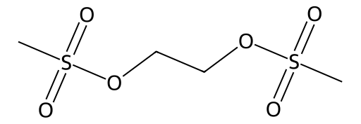

<!-- markdownlint-disable MD025 MD033 MD060 -->
# 乙烷二甲磺酸酯（EDS）

- [返回首页](../README.md)
- [1. 常见别名、物理性质、CAS编号、溶解度](#1-常见别名物理性质cas编号溶解度)
- [2. 化学性质、光热稳定性](#2-化学性质光热稳定性)
- [3. 生化特性](#3-生化特性)
- [4. 适应症、药理毒理](#4-适应症药理毒理)
- [5. 药代动力学、起效时间](#5-药代动力学起效时间)
- [6. 常见剂量、给药方式](#6-常见剂量给药方式)
- [7. 副作用、药物过量](#7-副作用药物过量)
- [8. 同分异构体与类似物](#8-同分异构体与类似物)
- [9. 在人体内整体作用](#9-在人体内整体作用)
- [10. 内分泌相关激素](#10-内分泌相关激素)
- [11. 对脂肪代谢](#11-对脂肪代谢)
- [12. 对血压的作用](#12-对血压的作用)
- [13. 对消化系统（急性）](#13-对消化系统急性)
- [14. 对神经系统的调节](#14-对神经系统的调节)
- [15. 对生殖系统](#15-对生殖系统)
- [16. 对皮肤的作用](#16-对皮肤的作用)
- [17. 过多或不足时的治疗](#17-过多或不足时的治疗)
- [18. 中医八纲辨证与五行归经](#18-中医八纲辨证与五行归经)

> EDS最著名的特点：**选择性Leydig细胞毒素**

## 1. 常见别名、物理性质、CAS编号、溶解度

- 常见名称：乙烷二甲磺酸酯、Ethane Dimethanesulfonate、EDS
- CAS编号：4672-49-5
- 分子式：C4H10O6S2
- 分子量：218.25 g/mol
- 外观：无色至淡黄色油状液体或低熔点固体
- 气味：弱刺激性
- 挥发性：低
- 溶解度
  - 水：有限溶解
  - 脂溶性：中等偏高
  - DMSO：易溶
  - 乙醇：易溶
  - 丙酮：易溶
  - 氯仿：可溶
  - 生理盐水：通常需助溶剂配制

## 2. 化学性质、光热稳定性

- 化学性质
  - 双功能烷化剂
  - 甲磺酸酯类细胞毒化合物
- 核心机制
  - 形成亲电中心
  - 与DNA、蛋白巯基发生烷基化
  - 导致细胞坏死
- 其化学行为与
  - 白消安（Busulfan）、苏消安（Treosulfan）存在一定相似性
  - 但EDS对Leydig细胞具有异常高选择性
- 光热稳定性
  - 避光保存
  - 高温下缓慢分解
  - 水解后活性下降
  - 碱性条件不稳定
  - 冷冻保存较稳定

## 3. 生化特性

> EDS最著名的特点：**选择性Leydig细胞毒素**

- 在大鼠中
  - 几乎特异性摧毁成熟Leydig细胞
  - 对支持细胞、曲细精管初期影响较小
  - 但继发性低睾酮会进一步影响生精
- 机制尚未完全明确，推测包括
  - Leydig细胞高表达特定转运系统
  - 谷胱甘肽代谢差异
  - 线粒体易损性
  - CYP相关代谢激活
- EDS诱导
  - 氧化应激
  - DNA损伤
  - 线粒体崩溃
  - caspase激活
  - 坏死与凋亡混合型死亡

## 4. 适应症、药理毒理

- 目前无正式人体医疗用途，主要用于动物实验
- 常用于
  - 去Leydig细胞模型
  - 睾酮剥夺模型
  - 雄激素缺乏研究
  - 生精依赖性研究
- 主要毒性
  - 睾丸毒性
  - 内分泌毒性
  - 生殖毒性
- 高剂量时可出现
  - 骨髓抑制
  - 肝毒性
  - 肾毒性
  - 全身细胞毒性

## 5. 药代动力学、起效时间

> 动物数据（大鼠）

- 起效（注射后）
  - 12–24小时：Leydig细胞出现空泡化
  - 24–48小时：大量坏死
  - 3–7天：Leydig细胞几乎消失
- 睾酮变化
  - 24小时开始下降
  - 48–72小时明显低下
  - 约1周达到谷底
- 恢复
  - 大鼠存在Leydig祖细胞再生能力
  - 通常2–6周逐渐恢复，年龄越大恢复越差

## 6. 常见剂量、给药方式

- 大鼠
  - 经典方案：75 mg/kg 单次腹腔注射
  - 也有50–100 mg/kg
  - 给药方式：腹腔注射（最常见）、静脉注射、皮下注射（较少）
- 人体
  - 无安全剂量数据
  - 不存在批准用法

## 7. 副作用、药物过量

- 急性反应
  - 睾丸疼痛
  - 睾酮骤降
  - 倦怠
  - 食欲下降
  - 体重下降
- 内分泌表现（低睾酮综合征）
  - 性欲下降
  - 勃起功能减退
  - 阴囊松弛
  - 肌力下降
  - 情绪低落
- 长期风险
  - 生精障碍
  - 睾丸萎缩
  - 不育
  - 骨质减少
- 过量，可能导致
  - 全身烷化剂毒性
  - 骨髓抑制
  - 多器官损伤
- 无特效解毒剂

## 8. 同分异构体与类似物

- EDS并无重要临床同分异构体
- 类似物（白消安）
  - 更强骨髓毒性
  - 亦可损伤生精细胞
  - 对Leydig选择性差
- 类似物（环磷酰胺 - Cyclophosphamide）
  - 生精细胞毒性明显
  - Leydig相对耐受
- 类似物（顺铂 - Cisplatin）
  - 生殖毒性强
  - 可导致长期不育
- EDS特殊性
  - 高度Leydig定向毒性
  - 这是多数细胞毒药物不具备的

## 9. 在人体内整体作用

- 核心后果
  - 急性睾酮合成崩溃
  - LH代偿升高
  - 生精功能继发受损
- 可能表现
  - 阴囊内容积下降
  - 睾丸质地变软
  - 精液量减少
  - 无精或少精
  - 性腺轴紊乱
- 长期，若Leydig细胞不可恢复
  - 持续性原发性性腺功能减退

## 10. 内分泌相关激素

- 下降
  - 睾酮
  - DHT
  - INSL3
- 继发升高
  - LH（显著）
  - FSH（中度）
- 雌激素
  - 初期下降
  - 后期因脂肪组织芳香化而相对升高

## 11. 对脂肪代谢

- 低睾酮后
  - 内脏脂肪增加
  - 脂蛋白代谢恶化
  - 胰岛素敏感性下降
  - 肌肉量减少
- 长期类似
  - 男性性腺功能减退综合征

## 12. 对血压的作用

> 间接作用为主

- 低睾酮可能导致
  - 血管张力下降
  - 疲劳
  - 运动耐量下降
- 长期代谢恶化后
  - 又可能促进高血压
- 因此呈“双相效应”

## 13. 对消化系统（急性）

- 高剂量可出现
  - 恶心
  - 食欲下降
  - 腹痛
  - 腹泻
- 机制
  - 烷化剂胃肠毒性
  - 细胞更新抑制

## 14. 对神经系统的调节

> 间接神经效应

- 由低雄激素导致
  - 动机下降
  - 快感减弱
  - 疲劳
  - 抑郁样行为
- 动物实验
  - 攻击性下降
  - 性行为减少
- 可能机制，涉及
  - 多巴胺系统
  - 下丘脑GnRH调节
  - 边缘系统雄激素受体

## 15. 对生殖系统

> 这是EDS最核心的领域

- 直接作用
  - 杀伤Leydig细胞
  - 抑制睾酮生成
- 间接作用
  - 生精抑制
  - 附睾功能下降
  - 精液参数恶化
- 睾丸外观
  - 睾丸缩小
  - 阴囊松弛
  - 曲细精管退化

## 16. 对皮肤的作用

- 低雄激素后
  - 皮脂减少
  - 胡须生长减慢
  - 皮肤变薄
  - 毛发减少
- 长期
  - 皮肤弹性下降

## 17. 过多或不足时的治疗

- 男性
  - Testosterone替代
  - hCG刺激残余Leydig细胞
  - FSH/hMG辅助生精
  - 若完全不可逆：长期雄激素替代
- 女性
  - 女性不存在Leydig细胞系统对应结构
  - 雌激素替代
  - 孕激素联合
  - GnRH类似物保护卵巢（化疗前）

## 18. 中医八纲辨证与五行归经

- 八纲：阳虚、肾虚、精亏
- 典型表现：畏寒、神疲、性功能下降、腰膝酸软、精少不育
- 五行：肾、命门
- 常见辨证：肾阳虚、肾精亏虚
- 常见中医思路：温肾助阳、填精益髓
