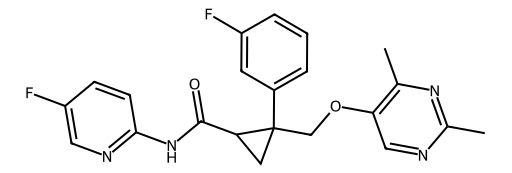

<!-- markdownlint-disable MD025 MD033 MD060 -->
# 莱博雷声（Lemborexant）

- [返回首页](../README.md)
- [1. 常见别名、物理性质、CAS编号、溶解度](#1-常见别名物理性质cas编号溶解度)
- [2. 化学性质、光热稳定性](#2-化学性质光热稳定性)
- [3. 生化特性](#3-生化特性)
- [4. 适应症、药理毒理](#4-适应症药理毒理)
- [5. 药代动力学、起效时间](#5-药代动力学起效时间)
- [6. 常见剂量、给药方式](#6-常见剂量给药方式)
- [7. 副作用、药物过量](#7-副作用药物过量)
- [8. 同分异构体与类似物](#8-同分异构体与类似物)
- [9. 在人体内整体作用](#9-在人体内整体作用)
- [10. 内分泌相关激素](#10-内分泌相关激素)
- [11. 对脂肪代谢](#11-对脂肪代谢)
- [12. 对血压的作用](#12-对血压的作用)
- [13. 对消化系统（急性）](#13-对消化系统急性)
- [14. 对神经系统的调节](#14-对神经系统的调节)
- [15. 对生殖系统](#15-对生殖系统)
- [16. 对皮肤的作用](#16-对皮肤的作用)
- [17. 过多或不足时的治疗](#17-过多或不足时的治疗)
- [18. 中医八纲辨证与五行归经](#18-中医八纲辨证与五行归经)

## 1. 常见别名、物理性质、CAS编号、溶解度

- 常见名：Dayvigo、莱博雷生、Lemborexant
- CAS编号：1369764-02-2  
- 分子式：C22H20F2N4O2
- 分子量：394.42
- 外观：白色至类白色结晶性粉末
- 溶解度
  - 水中溶解度较低
  - 易溶于部分有机溶剂（DMSO、甲醇等）
  - 实际制剂采用片剂形式提高口服利用度

## 2. 化学性质、光热稳定性

- 化学类别
  - 双重食欲素（Orexin）受体拮抗剂（DORA）
- 稳定性
  - 常温稳定保存（20–25°C）  
  - 对一般室内光线稳定
  - 高温、高湿长期暴露可能导致降解
- 代谢相关
  - 主要经 CYP3A4 代谢
  - 少量经 CYP3A5 代谢  

## 3. 生化特性

- 作用靶点
  - Orexin-1 receptor（OX1R）
  - Orexin-2 receptor（OX2R）
- 属于竞争性拮抗剂
- 其对 OX2R 的亲和力略高于 OX1R

## 4. 适应症、药理毒理

- 适应症
  - 入睡困难
  - 睡眠维持困难
  - 慢性失眠症
- 药理特点
- 与传统安眠药不同

  | 药物 | 主要机制 |
  |:----:|:-------:|
  | 地西泮 | GABA增强 |
  | 唑吡坦 | GABA-A激动 |
  | 博雷生 | 抑制觉醒系统 |

- 因此
  - 不直接抑制大脑皮层
  - 不属于苯二氮卓类
  - 对睡眠结构影响较小
- 毒理
- 大剂量可导致
  - 过度镇静
  - 跌倒风险增加
  - 次日嗜睡
- 但呼吸抑制明显轻于苯二氮卓类

## 5. 药代动力学、起效时间

- 吸收，达峰时间
  - 约1–3小时  
- 起效，临床感觉
  - 30～60分钟
- 推荐
  - 睡前立即服用
- 半衰期
  - 5 mg：17小时
  - 10 mg：19小时
- 排泄
  - 粪便约57%
  - 尿液约29%

## 6. 常见剂量、给药方式

- 成人
- 起始剂量
  - 5 mg 睡前一次
- 必要时
  - 10 mg 睡前一次
- 给药方式
  - 口服
- 要求
  - 服药后保证至少7小时睡眠时间

## 7. 副作用、药物过量

- 常见副作用
  - 嗜睡
  - 头晕
  - 疲劳
  - 头痛
- 特征性副作用
- 由于作用于食欲素系统，可出现
  - 睡眠麻痹（鬼压床）
  - 入睡前幻觉
  - 梦境增多
  - 清醒梦
- 罕见
  - 猝倒样发作
  - 夜间异常行为
- 过量
  - 长时间嗜睡
  - 认知迟钝
  - 共济失调
- 目前无特异性解毒剂

## 8. 同分异构体与类似物

- 同类DORA药物

  | 药物 | 特点 |
  |:---:|:---|
  | Suvorexant | 第一代DORA |
  | Daridorexant | 次日残留较少 |
  | Lemborexant | 入睡及维持睡眠效果较强 |

- 生化特点
  - 阻断食欲素系统
  - 不依赖GABA系统
  - 依赖性低于苯二氮卓类

## 9. 在人体内整体作用

- 觉醒下降
- 下调
  - 蓝斑核去甲肾上腺素系统
  - 中脑多巴胺系统
  - 组胺能系统
- 最终
  - 入睡更容易
  - 夜间觉醒减少

## 10. 内分泌相关激素

- 间接影响
  - 食欲素（Orexin A/B）
  - ACTH
  - 皮质醇节律
- 通常：不显著改变
  - 睾酮
  - 雌二醇
  - LH
  - FSH
  - 泌乳素
- 目前无证据显示其明显影响男性性激素水平

## 11. 对脂肪代谢

- 食欲素系统参与
  - 能量消耗
  - 棕色脂肪活化
  - 食欲调节
- 长期应用理论上可能
  - 略降低能量消耗
- 但临床体重变化通常不明显

## 12. 对血压的作用

- 常见情况
  - 影响极小
- 部分患者
  - 夜间血压轻度下降
  - 体位性低血压风险轻度增加
- 尤其
  - 老年人
  - 联合降压药时

## 13. 对消化系统（急性）

- 偶见
  - 恶心
  - 口干
  - 消化不良
- 发生率较低

## 14. 对神经系统的调节

- 这是莱博雷生最核心的作用
- 机制
  - 下丘脑食欲素神经元 →
  - OX1R/OX2R阻断 →
  - 觉醒驱动力下降 →
  - 睡眠启动
- 与苯二氮卓类相比
  - 不造成广泛神经抑制
  - 对记忆影响较轻
  - 依赖性较低

## 15. 对生殖系统

- 无明确影响
  - 睾酮
  - 精子生成
  - 勃起功能
- 间接作用，可能继发改善
  - 性欲
  - 晨勃
  - 睾酮昼夜节律

## 16. 对皮肤的作用

- 偶见
  - 皮疹
  - 瘙痒
- 发生率极低

## 17. 过多或不足时的治疗

- 过量
  - 停药
  - 监测呼吸循环
  - 对症支持
- 效果不足
  - 增加至 10 mg
  - 联合睡眠卫生管理
  - 更换其他DORA药物
  - 更换为非苯二氮卓类催眠药

## 18. 中医八纲辨证与五行归经

- 八纲：阴证、里证、虚实夹杂
- 五行：水（肾）、木（肝）
- 归经：心经、肝经、肾经
- 对应表现：心神不宁、肝阳扰神、阴虚失眠
