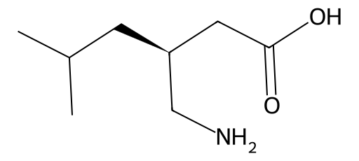

<!-- markdownlint-disable MD025 MD033 MD060 -->
# 普瑞巴林（PGB）

- [返回首页](../README.md)
- [1. 常见别名、物理性质、CAS编号、溶解度](#1-常见别名物理性质cas编号溶解度)
- [2. 化学性质、光热稳定性](#2-化学性质光热稳定性)
- [3. 生化特性](#3-生化特性)
- [4. 适应症、药理毒理](#4-适应症药理毒理)
- [5. 药代动力学、起效时间](#5-药代动力学起效时间)
- [6. 常见剂量、给药方式](#6-常见剂量给药方式)
- [7. 副作用、药物过量](#7-副作用药物过量)
- [8. 同分异构体与类似物](#8-同分异构体与类似物)
- [9. 在人体内整体作用](#9-在人体内整体作用)
- [10. 内分泌相关激素](#10-内分泌相关激素)
- [11. 对脂肪代谢](#11-对脂肪代谢)
- [12. 对血压的作用](#12-对血压的作用)
- [13. 对消化系统（急性）](#13-对消化系统急性)
- [14. 对神经系统的调节](#14-对神经系统的调节)
- [15. 对生殖系统](#15-对生殖系统)
- [16. 对皮肤的作用](#16-对皮肤的作用)
- [17. 过多或不足时的治疗](#17-过多或不足时的治疗)
- [18. 中医八纲辨证与五行归经](#18-中医八纲辨证与五行归经)

## 1. 常见别名、物理性质、CAS编号、溶解度

- 常见别名：Lyrica、普瑞加林、PGB
- CAS编号：148553-50-8
- 分子式：C₈H₁₇NO₂
- 结构特点：γ-氨基丁酸（GABA）类似物（但不直接作用于GABA受体）
- 白色或类白色结晶性粉末
- 熔点：约194–196°C
- 水溶性：高（>100 mg/mL）
- 有机溶剂：在乙醇中中等溶解，在非极性溶剂中溶解度低

## 2. 化学性质、光热稳定性

- 化学性质稳定，不易氧化
- 对光较稳定
- 热稳定性良好（常规储存条件下）
- 无明显光解或水解敏感性

## 3. 生化特性

- 结构类似GABA，但不激动GABA-A或GABA-B受体
- 高亲和力结合：电压依赖性钙通道 α2δ亚基
- 抑制以下神经递质释放
  - 谷氨酸
  - 去甲肾上腺素
  - P物质

## 4. 适应症、药理毒理

- 适应症
  - 神经病理性疼痛（糖尿病、带状疱疹后）
  - 癫痫部分性发作辅助治疗
  - 广泛性焦虑障碍（部分国家）
  - 纤维肌痛
- 药理作用核心
  - 抑制突触前Ca²⁺内流 → 减少兴奋性递质释放 → 镇痛、抗焦虑
- 毒理
  - 中枢抑制为主
  - 无明显肝毒性（相较加巴喷丁类似）

## 5. 药代动力学、起效时间

- 吸收
  - 口服生物利用度 ≥90%
- 达峰时间（Tmax）
  - 约1小时
- 蛋白结合率
  - <1%
- 代谢
  - 几乎不代谢
- 排泄
  - 肾脏原形排出
- 半衰期
  - 约6小时
- 起效时间
  - 抗焦虑：数小时内
  - 镇痛：1–3天开始明显
  - 稳定效果：约1周

## 6. 常见剂量、给药方式

- 起始剂量：75 mg，2次/日
- 常用范围：150–600 mg/日
- 最大剂量：600 mg/日
- 给药方式：口服

## 7. 副作用、药物过量

- 常见副作用
  - 头晕（最常见）
  - 嗜睡
  - 体重增加
  - 外周水肿
  - 共济失调
  - 性欲下降（部分）
- 过量表现
  - 显著镇静
  - 昏迷（高剂量）
  - 呼吸抑制（合并其他抑制药时）

## 8. 同分异构体与类似物

- S-对映体为活性形式
- 类似物
  - 加巴喷丁（Gabapentin）：亲和力更低
  - 米罗加巴林（Mirogabalin）：更选择性α2δ-1

## 9. 在人体内整体作用

- 中枢神经“降噪器”
- 降低神经元异常放电
- 对慢性疼痛与焦虑均有效

## 10. 内分泌相关激素

- 对激素轴影响较小
- 可轻度
  - 降低睾酮（间接）
  - 抑制应激轴（HPA轴）

## 11. 对脂肪代谢

- 增加食欲 → 体重增加
- 胰岛素敏感性变化不明显

## 12. 对血压的作用

- 轻度降低交感活性
- 可导致
  - 轻微降压
  - 或体位性低血压（少见）

## 13. 对消化系统（急性）

- 恶心（轻度）
- 食欲增加更常见
- 无明显胃黏膜损伤

## 14. 对神经系统的调节

- 抑制神经递质释放（核心）
- 抗焦虑机制
  - ↓去甲肾上腺素释放
- 镇痛机制
  - 降低P物质、降低谷氨酸

## 15. 对生殖系统

- 性欲下降（部分患者）
- 勃起功能轻度抑制（中枢性）
- 不直接影响精子生成

## 16. 对皮肤的作用

- 外周水肿（常见）
- 少见皮疹

## 17. 过多或不足时的治疗

- 过量
  - 对症支持
  - 严重者血液透析（可清除）
- 不足（疗效差）
  - 增量或换药
  - 加巴喷丁
  - 度洛西汀
  - 阿米替林
- 女性差异
  - 女性更易体重增加与水肿
  - 妊娠期需慎用（潜在致畸风险）

## 18. 中医八纲辨证与五行归经

- 八纲：偏虚实夹杂，以虚为本
- 五行归经：肝（主筋，神经痛）、心（神志）、肾（慢性疼痛基础）
- 中医效应：安神，止痛，抑风（类似“息风止痛”）
