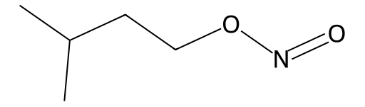

<!-- markdownlint-disable MD025 MD033 MD060 -->
# 亚硝酸异戊酯（Isopentyl Nitrite）

- [返回首页](../README.md)
- [1. 常见别名、物理性质、CAS编号、溶解度](#1-常见别名物理性质cas编号溶解度)
- [2. 化学性质、光热稳定性](#2-化学性质光热稳定性)
- [3. 生化特性](#3-生化特性)
- [4. 适应症、药理毒理](#4-适应症药理毒理)
- [5. 药代动力学、起效时间](#5-药代动力学起效时间)
- [6. 常见剂量、给药方式](#6-常见剂量给药方式)
- [7. 副作用、药物过量](#7-副作用药物过量)
- [8. 同分异构体与类似物](#8-同分异构体与类似物)
- [9. 在人体内整体作用](#9-在人体内整体作用)
- [10. 内分泌相关激素](#10-内分泌相关激素)
- [11. 对脂肪代谢](#11-对脂肪代谢)
- [12. 对血压的作用](#12-对血压的作用)
- [13. 对消化系统（急性）](#13-对消化系统急性)
- [14. 对神经系统的调节](#14-对神经系统的调节)
- [15. 对生殖系统](#15-对生殖系统)
- [16. 对皮肤的作用](#16-对皮肤的作用)
- [17. 过多或不足时的治疗](#17-过多或不足时的治疗)
- [18. 中医八纲辨证与五行归经](#18-中医八纲辨证与五行归经)

- 返回[【综述】亚硝酸酯](../../Extreme_Intervention_Integration/Mild_Intoxication_Archives/Alkyl_Nitrites.md)
- 类似物：[亚硝酸异丁酯](./Extreme_Intervention_Integration/Mild_Intoxication_Archives/Isoamyl_Nitrite.md) | [亚硝酸异丙酯](./Extreme_Intervention_Integration/Mild_Intoxication_Archives/Isopropyl_Nitrite.md) | [亚硝酸异戊酯](./Extreme_Intervention_Integration/Mild_Intoxication_Archives/Isopentyl_Nitrite.md) | [亚硝酸正丁酯](./Extreme_Intervention_Integration/Mild_Intoxication_Archives/Butyl_Nitrite.md)

> 禁与PDE5抑制剂（西地那非、他达拉非）同用  
> 可致严重低血压  
> 易引起高铁血红蛋白血症  
> 多国列为受控物质  

## 1. 常见别名、物理性质、CAS编号、溶解度

- 名称：亚硝酸异戊酯，Isoamyl Nitrite，Isopentyl Nitrite
- 别名：异戊基亚硝酸酯、戊亚硝酸酯、Amyl nitrite（历史上常与正戊酯混用）
- CAS号：110-46-3（常见为异戊型）
- 分子式：C₅H₁₁NO₂
- 分子量：117.15
- 淡黄色透明挥发性液体
- 有明显果香样刺激性气味
- 密度：约0.87 g/mL（20℃）
- 沸点：约96–99℃
- 挥发性强，蒸气易吸入
- 溶解度
  - 水中：微溶
  - 乙醇、乙醚、氯仿、脂类：易溶
  - 有机溶剂中高度溶解

## 2. 化学性质、光热稳定性

- 属有机亚硝酸酯类
- 受光、热、空气易分解
- 可缓慢氧化生成亚硝酸及相应醇
- 遇强氧化剂、酸碱可分解
- 避光密闭冷藏保存

## 3. 生化特性

- 体内迅速释放一氧化氮（NO）
- 激活可溶性鸟苷酸环化酶（sGC）
- ↑cGMP → 平滑肌松弛
- 强烈外周血管扩张作用
- 氧化血红蛋白为高铁血红蛋白

## 4. 适应症、药理毒理

- 历史适应症
  - 心绞痛（舌下吸入）
  - 氰化物中毒（诱导高铁血红蛋白）
- 当前情况
  - 临床已基本被硝酸甘油等替代
  - 某些国家限制或管制
- 药理作用
  - 强烈动静脉扩张
  - 降低前负荷
  - 短暂降低血压
  - 反射性心动过速
- 毒理
  - 高铁血红蛋白血症
  - 低血压性休克
  - 中枢抑制

## 5. 药代动力学、起效时间

- 给药方式：吸入
- 起效时间：10–30秒
- 峰值：1–2分钟
- 持续时间：3–5分钟
- 代谢：肝脏代谢为亚硝酸盐
- 排泄：肾脏

## 6. 常见剂量、给药方式

- 历史心绞痛治疗：吸入0.2–0.4 mL蒸气
- 氰化物中毒：吸入一支安瓿（医疗专用剂量）
- 非医疗使用风险极高

## 7. 副作用、药物过量

- 常见副作用
  - 面部潮红
  - 头痛（脑血管扩张）
  - 眩晕
  - 心悸
  - 低血压
- 严重过量
  - 昏迷
  - 严重高铁血红蛋白血症
  - 紫绀
  - 休克
- 解毒
  - 亚甲蓝（治疗高铁血红蛋白血症）

## 8. 同分异构体与类似物

- 亚硝酸异丙酯：起效更快，挥发更强
- 亚硝酸正戊酯：作用时间稍长
- 亚硝酸丁酯：常见滥用型
- 生化机制相同：均为NO供体

## 9. 在人体内整体作用

- 外周血管显著扩张
- 心率反射性增加
- 短暂脑血流增加
- 平滑肌松弛（包括肛门、泌尿生殖道）

## 10. 内分泌相关激素

- 不直接影响激素分泌
- 间接因血流改变影响肾素-血管紧张素系统
- 可能短暂抑制交感神经张力

## 11. 对脂肪代谢

- 无直接影响
- 急性低血压可短暂改变脂肪动员

## 12. 对血压的作用

- 快速明显下降（收缩压可下降20–40 mmHg）
- 反射性心率增加
- 可诱发晕厥

## 13. 对消化系统（急性）

- 食管下括约肌松弛
- 可缓解食管痉挛
- 恶心（低血压所致）

## 14. 对神经系统的调节

- 机制
  - NO → cGMP ↑ → 血管扩张
- 表现
  - 短暂欣快
  - 头晕
  - 视觉模糊
  - 严重时意识障碍

## 15. 对生殖系统

- 平滑肌松弛
- 肛门括约肌松弛
- 增加局部血流
- 不提高睾酮
- 不改善勃起功能（与PDE5抑制剂机制不同）
- 与西地那非合用可致致命低血压

## 16. 对皮肤的作用

- 面部潮红
- 出汗
- 低血压相关苍白

## 17. 过多或不足时的治疗

- 过量（低血压）
  - 男性治疗：补液、升压药
  - 非孕期女性：同样处理
- 高铁血红蛋白
  - 男性治疗：亚甲蓝
  - 非孕期女性：同样处理
- 女性使用风险相同

## 18. 中医八纲辨证与五行归经

- 八纲：性温，走窜，属开泄之品
- 五行归经：入心、肝经，属火性
- 作用偏向：行气活血，开郁散结
- 但属急性耗气之品，不宜久用
