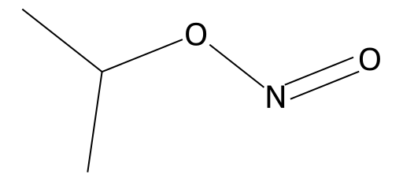

<!-- markdownlint-disable MD025 MD033 MD060 -->
# 亚硝酸异丙酯（Isopropyl Nitrite）

- [返回首页](../README.md)
- [1. 常见别名、物理性质、CAS编号、溶解度](#1-常见别名物理性质cas编号溶解度)
- [2. 化学性质、光热稳定性](#2-化学性质光热稳定性)
- [3. 生化特性](#3-生化特性)
- [4. 适应症、药理毒理](#4-适应症药理毒理)
- [5. 药代动力学、起效时间](#5-药代动力学起效时间)
- [6. 常见剂量、给药方式](#6-常见剂量给药方式)
- [7. 副作用、药物过量](#7-副作用药物过量)
- [8. 同分异构体与类似物](#8-同分异构体与类似物)
- [9. 在人体内整体作用](#9-在人体内整体作用)
- [10. 内分泌相关激素](#10-内分泌相关激素)
- [11. 对脂肪代谢](#11-对脂肪代谢)
- [12. 对血压的作用](#12-对血压的作用)
- [13. 对消化系统（急性）](#13-对消化系统急性)
- [14. 对神经系统的调节](#14-对神经系统的调节)
- [15. 对生殖系统](#15-对生殖系统)
- [16. 对皮肤的作用](#16-对皮肤的作用)
- [17. 过多或不足时的治疗](#17-过多或不足时的治疗)
- [18. 中医八纲辨证与五行归经](#18-中医八纲辨证与五行归经)

- 返回：[【综述】亚硝酸酯](../../Extreme_Intervention_Integration/Mild_Intoxication_Archives/Alkyl_Nitrites.md)
- 类似物：[亚硝酸异丁酯](./Extreme_Intervention_Integration/Mild_Intoxication_Archives/Isoamyl_Nitrite.md) | [亚硝酸异丙酯](./Extreme_Intervention_Integration/Mild_Intoxication_Archives/Isopropyl_Nitrite.md) | [亚硝酸异戊酯](./Extreme_Intervention_Integration/Mild_Intoxication_Archives/Isopentyl_Nitrite.md) | [亚硝酸正丁酯](./Extreme_Intervention_Integration/Mild_Intoxication_Archives/Butyl_Nitrite.md)

> 亚硝酸异丙酯为强效短效NO供体，主要作用为快速血管扩张

## 1. 常见别名、物理性质、CAS编号、溶解度

- 中文名：亚硝酸异丙酯
- 英文名：Isopropyl nitrite
- 常见别名：异丙基亚硝酸酯、2-丙基亚硝酸酯
- AS号：541-42-4
- 分子式：C₃H₇NO₂
- 分子量：89.09
- 无色至淡黄色挥发性液体
- 有甜味样或水果样气味
- 沸点：约40–45°C（高度挥发）
- 密度：约0.87 g/mL（20°C）
- 易燃
- 溶解度
  - 水中：微溶（易水解）
  - 有机溶剂：易溶于乙醇、乙醚、氯仿、脂溶性溶剂

## 2. 化学性质、光热稳定性

- 属于有机亚硝酸酯类（R-ONO）
- 易水解生成异丙醇与亚硝酸
- 遇光、热不稳定，易分解
- 易氧化并释放一氧化氮（NO）
- 与强氧化剂、酸、碱不相容
- 光稳定性差，需避光低温保存

## 3. 生化特性

- 在体内迅速释放一氧化氮（NO）
- 激活鸟苷酸环化酶（sGC）
- 增加cGMP水平
- 使血管平滑肌松弛
- 属于强效短效NO供体

## 4. 适应症、药理毒理

- 历史适应症（现基本不用）
  - 心绞痛
  - 急性心衰
- 药理作用
  - 强烈血管扩张
  - 静脉扩张 > 动脉扩张
  - 降低前负荷
- 毒理
  - 诱发高铁血红蛋白血症
  - 严重低血压
  - 缺氧
  - 心律失常

## 5. 药代动力学、起效时间

- 吸入后数秒起效
- 作用持续约2–5分钟
- 主要经肺代谢
- 代谢为亚硝酸盐和硝酸盐
- 经尿排泄
- 首过效应不明显（因吸入给药）

## 6. 常见剂量、给药方式

- 医疗用途已基本淘汰
- 滥用方式
  - 吸入挥发气体（非法用途）
- 无安全推荐剂量

## 7. 副作用、药物过量

- 常见副作用
  - 面部潮红
  - 头痛（血管扩张性）
  - 心悸
  - 头晕
  - 低血压
- 严重过量
  - 高铁血红蛋白血症（发绀）
  - 昏迷
  - 心源性休克
  - 突然死亡
- 解毒
  - 亚甲蓝（治疗高铁血红蛋白血症）

## 8. 同分异构体与类似物

- 同分异构体
  - 亚硝酸正丙酯
- 类似物（常见挥发性亚硝酸酯）
  - 亚硝酸异戊酯
  - 亚硝酸丁酯
  - 亚硝酸异戊酯
- 生化机制一致：均释放NO，但脂溶性和挥发性不同，起效时间与持续时间略有差异

## 9. 在人体内整体作用

- 核心机制
  - NO ↑ → cGMP ↑ → 血管扩张
- 全身效应
  - 外周血管扩张
  - 心率反射性增加
  - 血压下降
  - 短暂脑血流增加

## 10. 内分泌相关激素

- 不直接作用于激素分泌
- 通过血流变化影响勃起功能
- 不影响睾酮水平

## 11. 对脂肪代谢

- 无直接调脂作用
- 长期滥用可能因缺氧影响线粒体功能

## 12. 对血压的作用

- 快速、明显降压
- 可引起体位性低血压
- 与PDE5抑制剂（如西地那非）合用可致致命性低血压

## 13. 对消化系统（急性）

- 平滑肌松弛
- 可引起恶心
- 食管括约肌松弛

## 14. 对神经系统的调节

- 头痛机制：脑血管扩张
- 短暂欣快感（与脑血流改变有关）
- 高剂量可引起缺氧性脑损伤

## 15. 对生殖系统

- 肛门括约肌松弛
- 阴茎勃起增强（血管扩张）
- 不改善精子质量
- 长期滥用可能导致勃起功能反跳性障碍

## 16. 对皮肤的作用

- 面部潮红
- 局部接触可致刺激性皮炎
- 反复接触可引起接触性皮炎

## 17. 过多或不足时的治疗

- 过量治疗（男性）
  - 亚甲蓝
  - 吸氧
  - 补液升压
- 女性非孕期用药差异
  - 基本无性别差异
  - 妊娠期禁用（胎儿缺氧风险）

## 18. 中医八纲辨证与五行归经

- 性质：辛散走窜，性温偏燥
- 八纲：属阳证，易耗气伤阴，可动风动血
- 归经推测：心经（血脉），肝经（疏泄）
- 五行：偏火性（促血行）
