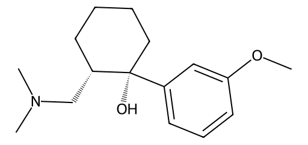

<!-- markdownlint-disable MD025 MD033 MD060 -->
# 曲马多（Tramadol）

- [返回首页](../README.md)
- [1. 常见别名、物理性质、CAS编号、溶解度](#1-常见别名物理性质cas编号溶解度)
- [2. 化学性质、光热稳定性](#2-化学性质光热稳定性)
- [3. 生化特性](#3-生化特性)
- [4. 适应症、药理毒理](#4-适应症药理毒理)
- [5. 药代动力学、起效时间](#5-药代动力学起效时间)
- [6. 常见剂量、给药方式](#6-常见剂量给药方式)
- [7. 副作用、药物过量](#7-副作用药物过量)
- [8. 同分异构体与类似物](#8-同分异构体与类似物)
- [9. 在人体内整体作用](#9-在人体内整体作用)
- [10. 内分泌相关激素](#10-内分泌相关激素)
- [11. 对脂肪代谢](#11-对脂肪代谢)
- [12. 对血压的作用](#12-对血压的作用)
- [13. 对消化系统（急性）](#13-对消化系统急性)
- [14. 对神经系统的调节](#14-对神经系统的调节)
- [15. 对生殖系统](#15-对生殖系统)
- [16. 对皮肤的作用](#16-对皮肤的作用)
- [17. 过多或不足时的治疗](#17-过多或不足时的治疗)
- [18. 中医八纲辨证与五行归经](#18-中医八纲辨证与五行归经)

## 1. 常见别名、物理性质、CAS编号、溶解度

- 常见别名：曲马多，Tramadol，Tramal（商品名），Ultram，盐酸曲马多
- CAS编号
  - 27203-92-5（Tramadol）
  - 36282-47-0（盐酸曲马多）
- 分子式：C₁₆H₂₅NO₂
- 分子量：263.38
- 白色或类白色结晶性粉末
- 味微苦
- pKa ≈ 9.4
- 溶解度
  - 水：易溶
  - 乙醇：易溶
  - 氯仿：中等
  - 乙醚：微溶
  - 甲醇：高溶解度
  - 丙酮：中等

## 2. 化学性质、光热稳定性

- 苯环 + 二甲氨基 + 环己醇结构
- 属于苯丙胺样弱阿片结构
- 光稳定性
  - 常规光照稳定
  - 长期强光可能降解
- 热稳定性：熔点约 180°C（盐酸盐）
- pH稳定范围：pH 4–7 最稳定
- 氧化：强氧化剂可降解

## 3. 生化特性

- 曲马多是双机制镇痛药，作用包括
  - 弱 μ 阿片受体激动剂
  - 抑制去甲肾上腺素再摄取
  - 抑制5-HT再摄取
- 其主要活性代谢物
  - O-去甲曲马多 (M1)
- 对 μ受体亲和力约为母体 200倍

## 4. 适应症、药理毒理

- 临床用于
  - 中度疼痛
  - 术后疼痛
  - 神经性疼痛
  - 癌痛辅助镇痛
- 在部分国家也用于
  - 慢性腰痛
  - 骨关节炎痛
- 镇痛效力
  - ≈ 吗啡 1/10
- 毒理特点
  - 呼吸抑制较弱
  - 成瘾性低于传统阿片
  - 癫痫阈值下降
  - 5-HT综合征
- 依赖性
  - LD50（大鼠）：≈ 300 mg/kg

## 5. 药代动力学、起效时间

- 吸收：口服生物利用度约 70%
- 起效时间
  - 口服：30–60 min
  - 静脉：5–10 min
- 峰值时间：2 h
- 半衰期
  - 母体：6 h
  - 活性代谢物：7–9 h
- 主要在肝脏
  - CYP2D6 → O-去甲曲马多（活性）
  - CYP3A4 → N-去甲曲马多
- 排泄
  - 肾脏为主

## 6. 常见剂量、给药方式

- 口服
  - 50–100 mg
  - 每4–6小时一次
- 最大剂量
  - 400 mg/天
- 缓释制剂
  - 100–300 mg / 天
- 给药方式
  - 口服片
  - 缓释片
  - 静脉注射
  - 肌肉注射

## 7. 副作用、药物过量

- 常见副作用
  - 恶心
  - 眩晕
  - 嗜睡
  - 便秘
  - 出汗
- 较少见
  - 癫痫
  - 心动过速
  - 精神异常
- 过量表现
  - 呼吸抑制
  - 癫痫
  - 昏迷
  - 低血压
- 解毒
  - 纳洛酮：但纳洛酮可能诱发癫痫

## 8. 同分异构体与类似物

- (+)-Tramadol
  - 主要抑制5-HT再摄取
- (–)-Tramadol
  - 抑制NE再摄取
- 类似药物
  - 他喷他多
  - 哌替啶
  - 吗啡
- Tapentadol 与曲马多类似但
  - 不依赖 CYP2D6
  - 镇痛更强

## 9. 在人体内整体作用

- 主要系统作用
  - 镇痛
  - 轻度镇静
  - 抗抑郁样作用（单胺机制）
- 长期使用可能
  - 耐受
  - 依赖

## 10. 内分泌相关激素

- 抑制
  - GnRH
  - LH
  - FSH
- 结果
  - 睾酮下降
  - 性欲降低
- 不过曲马多作用较轻

## 11. 对脂肪代谢

- 影响较小，但长期阿片类可能
  - 降低基础代谢
  - 轻度脂肪增加
- 机制
  - 下丘脑抑制
  - 睾酮下降

## 12. 对血压的作用

- 轻度
  - 外周血管扩张
  - 低血压（少见）
- 高剂量
  - 交感兴奋
  - 心率升高

## 13. 对消化系统（急性）

- 急性作用
  - 恶心
  - 呕吐
  - 胃排空延迟
  - 便秘
- 原因：μ受体 → 肠蠕动抑制

## 14. 对神经系统的调节

- 作用机制
  - μ受体激动
  - NE/5-HT再摄取抑制
  - 下行镇痛通路增强
- 结果
  - 镇痛
  - 镇静
  - 情绪改善
- 风险
  - 癫痫
  - 5-HT综合征

## 15. 对生殖系统

- 可能出现
  - 性欲下降
  - 勃起功能下降
  - 精子减少（长期）
- 机制
  - 阿片 → 抑制 HPG 轴

## 16. 对皮肤的作用

- 常见
  - 出汗
  - 瘙痒
  - 潮红
- 机制
  - 组胺释放

## 17. 过多或不足时的治疗

- 过量治疗
  - 纳洛酮
  - 苯二氮卓类控制癫痫
  - 支持治疗
- 依赖治疗
  - 丁丙诺啡
  - 美沙酮
- 女性用药区别
  - 妊娠期需避免
  - 哺乳期慎用

## 18. 中医八纲辨证与五行归经

- 寒热：偏温
- 虚实：实证止痛
- 气血关系：行气止痛
- 归经：肝经、心经、脾经
- 五行：肝木、心火
