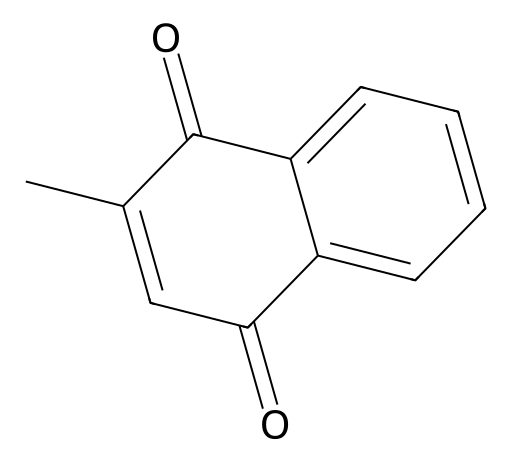

<!-- markdownlint-disable MD025 MD033 MD060 -->
# 甲萘醌（Menadione）

- [返回首页](../README.md)
- [1. 常见别名、物理性质、CAS编号、溶解度](#1-常见别名物理性质cas编号溶解度)
- [2. 化学性质、光热稳定性](#2-化学性质光热稳定性)
- [3. 生化特性](#3-生化特性)
- [4. 适应症、药理毒理](#4-适应症药理毒理)
- [5. 药代动力学、起效时间](#5-药代动力学起效时间)
- [6. 常见剂量、给药方式](#6-常见剂量给药方式)
- [7. 副作用、药物过量](#7-副作用药物过量)
- [8. 同分异构体与类似物](#8-同分异构体与类似物)
- [9. 在人体内整体作用](#9-在人体内整体作用)
- [10. 内分泌相关激素](#10-内分泌相关激素)
- [11. 对脂肪代谢](#11-对脂肪代谢)
- [12. 对血压的作用](#12-对血压的作用)
- [13. 对消化系统（急性）](#13-对消化系统急性)
- [14. 对神经系统的调节](#14-对神经系统的调节)
- [15. 对生殖系统](#15-对生殖系统)
- [16. 对皮肤的作用](#16-对皮肤的作用)
- [17. 过多或不足时的治疗](#17-过多或不足时的治疗)
- [18. 中医八纲辨证与五行归经](#18-中医八纲辨证与五行归经)

> 维生素K3是人工合成的萘醌类维生素K衍生物，具有促凝血活性，但因溶血与肝毒性风险较高  
> 在人类医学中基本被K1、K2取代。成年男性一般不建议使用  

## 1. 常见别名、物理性质、CAS编号、溶解度

- 常见别名：甲萘醌、Menadione、2-甲基-1,4-萘醌
- CAS编号：58-27-5
- 分子式：C₁₁H₈O₂
- 分子量：172.18 g/mol
- 物理性质
  - 黄色至淡黄色结晶性粉末
  - 熔点约105–107℃
  - 有轻微刺激性气味
- 溶解度
  - 水中：几乎不溶（<0.1 mg/mL）
  - 乙醇、丙酮、氯仿：易溶
  - 常制成亚硫酸氢钠加成物（Menadione sodium bisulfite）以提高水溶性

## 2. 化学性质、光热稳定性

- 属于萘醌类脂溶性醌结构
- 可发生氧化还原循环（醌/半醌/氢醌）
- 对光较敏感，光照易降解
- 热稳定性中等，高温易分解
- 易参与自由基反应

## 3. 生化特性

- 为维生素K活性母核结构
- 在体内可被烷基化生成类似维生素K2（甲萘醌类）的活性形式
- 参与γ-谷氨酰羧化酶系统
- 促进凝血因子（II、VII、IX、X）活化

## 4. 适应症、药理毒理

- 药理作用
  - 促进凝血因子合成
  - 影响骨钙素（osteocalcin）活化
- 临床应用
  - 过去用于低凝血酶原血症
  - 目前人用已基本淘汰（毒性问题）
  - 主要用于兽医领域
- 毒理
  - 可引发溶血性贫血（尤其G6PD缺乏者）
  - 可能导致高胆红素血症
  - 新生儿可致核黄疸

## 5. 药代动力学、起效时间

- 口服吸收较快
- 脂溶性，肝脏代谢
- 半衰期较短（数小时）
- 主要经胆汁排泄
- 起效时间：6–12小时影响凝血功能

## 6. 常见剂量、给药方式

- 目前成人男性临床已不推荐使用
- 历史剂量
  - 口服 5–10 mg/日
  - 肌注 10 mg

## 7. 副作用、药物过量

- 溶血
- 高铁血红蛋白血症
- 肝毒性
- 皮疹
- 过量可致严重贫血与肝损伤

## 8. 同分异构体与类似物

| 代表物质 | 来源 | 特点 |
|:----:|:----:|:----:|
| 维生素K1 | 植物来源 | 安全性高 |
| 维生素K2 | 肠道菌合成 | 骨保护更强 |
| 维生素K3 | 人工合成 | 毒性较大 |

- 维生素K1、维生素K2安全性明显优于维生素K3

## 9. 在人体内整体作用

- 促进凝血功能
- 参与骨代谢
- 影响血管钙化过程
- 但由于氧化应激作用，长期使用可能损伤红细胞与肝细胞

## 10. 内分泌相关激素

- 不直接调节雄激素
- K2有促进睾酮合成的研究
- K3无明确促进睾酮证据

## 11. 对脂肪代谢

- 通过影响骨钙素间接参与胰岛素敏感性调节
- 无显著直接调脂作用

## 12. 对血压的作用

- 间接通过血管钙化调节
- 无直接降压作用

## 13. 对消化系统（急性）

- 口服可致胃肠刺激
- 恶心、腹痛

## 14. 对神经系统的调节

- 高胆红素状态下可致神经毒性（新生儿风险最高）
- 成年男性风险较低

## 15. 对生殖系统

- 无明确直接作用
- 无改善精子或性功能证据

## 16. 对皮肤的作用

- 外用可刺激
- 高剂量可致皮肤黄染

## 17. 过多或不足时的治疗

- 维生素K缺乏：优选维生素K1、维生素K2
- 维生素K3中毒：停药、输血、抗氧化治疗
- 女性（非孕期）治疗原则相同，但贫血风险评估更重要

## 18. 中医八纲辨证与五行归经

- 性味：苦、寒
- 归经：肝、心
- 功效类比：凉血止血
- 八纲：属“血分实热”调节
- 五行：木（肝）
