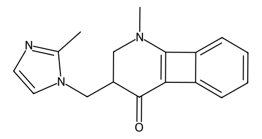

<!-- markdownlint-disable MD025 MD033 MD060 -->
# 昂丹司琼（Ondansetron）

- [返回首页](../README.md)
- 另请参见：**[帕洛诺司琼](../Functional_Reshaping_Records/Palonosetron.md)**
- [1. 常见别名、物理性质、CAS编号、溶解度](#1-常见别名物理性质cas编号溶解度)
- [2. 化学性质、光热稳定性](#2-化学性质光热稳定性)
- [3. 生化特性](#3-生化特性)
- [4. 适应症、药理毒理](#4-适应症药理毒理)
- [5. 药代动力学、起效时间](#5-药代动力学起效时间)
- [6. 常见剂量、给药方式](#6-常见剂量给药方式)
- [7. 副作用、药物过量](#7-副作用药物过量)
- [8. 同分异构体与类似物](#8-同分异构体与类似物)
- [9. 在人体内整体作用](#9-在人体内整体作用)
- [10. 内分泌相关激素](#10-内分泌相关激素)
- [11. 对脂肪代谢](#11-对脂肪代谢)
- [12. 对血压的作用](#12-对血压的作用)
- [13. 对消化系统（急性）](#13-对消化系统急性)
- [14. 对神经系统的调节](#14-对神经系统的调节)
- [15. 对生殖系统](#15-对生殖系统)
- [16. 对皮肤的作用](#16-对皮肤的作用)
- [17. 过多或不足时的治疗](#17-过多或不足时的治疗)
- [18. 中医八纲辨证与五行归经](#18-中医八纲辨证与五行归经)

> 优点：高选择性，无镇静，不影响性激素  
> 风险点：QT延长（尤其与其他延长QT药物合用），便秘

## 1. 常见别名、物理性质、CAS编号、溶解度

- 通用名：昂丹司琼
- 英文名：Ondansetron
- 常见别名：恩丹西酮、Zofran
- CAS编号：99614-02-5
- 分子式：C₁₈H₁₉N₃O
- 白色或类白色结晶性粉末
- 分子量：293.36 g/mol
- 熔点：约178–183℃
- pKa：约7.4（弱碱性）
- LogP：约2.4（脂溶性中等）
- 溶解度
  - 水：微溶（盐酸盐形式水溶性明显提高）
  - 乙醇：可溶
  - 甲醇：易溶
  - 氯仿：可溶
  - 有机极性溶剂：溶解性良好

## 2. 化学性质、光热稳定性

- 含有咔唑结构衍生物骨架
- 弱碱性，可形成盐（常见盐酸盐）
- 光稳定性较好，但需避光保存
- 热稳定性中等，高温长期可分解
- 在强酸强碱条件下可能水解

## 3. 生化特性

- 选择性5-HT₃受体拮抗剂
- 作用于
  - 外周迷走神经末梢
  - 延髓化学感受触发区（CTZ）
- 阻断5-羟色胺（5-HT）诱发的呕吐反射

## 4. 适应症、药理毒理

- 适应症
  - 化疗相关恶心呕吐（CINV）
  - 放疗相关恶心呕吐
  - 术后恶心呕吐（PONV）
- 药理作用
  - 抑制迷走神经传入冲动
  - 不影响多巴胺受体（无锥体外系副作用）
- 毒理
  - 安全窗口较宽
  - 高剂量可能导致QT间期延长

## 5. 药代动力学、起效时间

- 口服生物利用度：约60%
- 首过代谢明显
- Tmax：1.5–2小时
- 半衰期：3–5小时
- 肝代谢（CYP3A4、CYP2D6、CYP1A2）
- 代谢物经尿和胆汁排泄
- 稳态：约1–2天内达到

## 6. 常见剂量、给药方式

- 成人男性
  - 化疗预防：8 mg 口服，每日2次
  - 术后：4 mg 静脉注射
  - 重度化疗：可达24 mg单次
- 给药途径
  - 口服片
  - 口腔崩解片
  - 静脉注射

## 7. 副作用、药物过量

- 常见副作用
  - 头痛（最常见）
  - 便秘
  - 轻度肝酶升高
  - QT延长
- 过量表现
  - 严重心律失常
  - 视觉障碍
  - 低血压
- 无特异性解毒剂，对症支持治疗

## 8. 同分异构体与类似物

- 结构类似物
  - 格拉司琼
  - 托烷司琼
  - 帕洛诺司琼
- 生化特性比较
  - 帕洛诺司琼半衰期最长（约40小时）
  - 格拉司琼更强选择性
  - 托烷司琼兼具部分5-HT4作用

## 9. 在人体内整体作用

- 抑制中枢与外周呕吐通路
- 对意识、情绪影响极小
- 不影响胃排空显著

## 10. 内分泌相关激素

- 对睾酮、雌二醇无直接影响
- 不影响HPT轴
- 长期使用对激素水平影响极小

## 11. 对脂肪代谢

- 无直接调节作用
- 可能因食欲改善间接影响体重

## 12. 对血压的作用

- 一般无明显影响
- 静脉快速推注可轻度低血压

## 13. 对消化系统（急性）

- 抑制呕吐反射
- 可能减弱肠蠕动 → 便秘
- 不显著影响胃酸分泌

## 14. 对神经系统的调节

- 阻断5-HT3受体（离子通道型）
- 不作用于GABA、多巴胺
- 无镇静、无成瘾性

## 15. 对生殖系统

- 无直接作用
- 不影响勃起功能或性欲

## 16. 对皮肤的作用

- 罕见皮疹
- 极罕见过敏反应

## 17. 过多或不足时的治疗

- 过量：QT延长
  - 硫酸镁静脉给药
  - 停药
  - 心电监护
- 恶心控制不足
  - 联合地塞米松
  - 联合NK1受体拮抗剂
- 对比女性
  - 妊娠期使用需谨慎（争议存在）
  - 男性无生殖毒性问题

## 18. 中医八纲辨证与五行归经

- 八纲
  - 属“降逆止呕”
  - 偏于“里证”
  - 不偏寒热
- 五行归经（类比分析）
  - 主入胃经
  - 兼入心包经（中枢调节）
