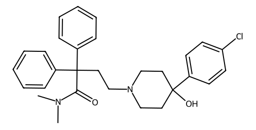

<!-- markdownlint-disable MD025 MD033 MD060 -->
# 帕洛诺司琼（Palonosetron）

- [返回首页](../README.md)
- 另请参见：[昂丹司琼](../Functional_Reshaping_Records/Ondansetron.md)
- [1. 常见别名、物理性质、CAS编号、溶解度](#1-常见别名物理性质cas编号溶解度)
- [2. 化学性质、光热稳定性](#2-化学性质光热稳定性)
- [3. 生化特性](#3-生化特性)
- [4. 适应症、药理毒理](#4-适应症药理毒理)
- [5. 药代动力学、起效时间](#5-药代动力学起效时间)
- [6. 常见剂量、给药方式](#6-常见剂量给药方式)
- [7. 副作用、药物过量](#7-副作用药物过量)
- [8. 同分异构体与类似物](#8-同分异构体与类似物)
- [9. 在人体内整体作用](#9-在人体内整体作用)
- [10. 内分泌相关激素](#10-内分泌相关激素)
- [11. 对脂肪代谢](#11-对脂肪代谢)
- [12. 对血压的作用](#12-对血压的作用)
- [13. 对消化系统（急性）](#13-对消化系统急性)
- [14. 对神经系统的调节](#14-对神经系统的调节)
- [15. 对生殖系统](#15-对生殖系统)
- [16. 对皮肤的作用](#16-对皮肤的作用)
- [17. 过多或不足时的治疗](#17-过多或不足时的治疗)
- [18. 中医八纲辨证与五行归经](#18-中医八纲辨证与五行归经)

> 帕洛诺司琼是第二代5-HT3受体拮抗剂，核心优势在于

- > 超长半衰期（≈40小时）
- > 对延迟性呕吐显著有效
- > 受体内化机制（独特）
- > 对全身系统影响极小（尤其对生殖、内分泌几乎无影响）

## 1. 常见别名、物理性质、CAS编号、溶解度

- 常见别名：帕洛诺司琼、Palonosetron hydrochloride
- CAS编号：135729-61-2（游离碱），135729-62-3（盐酸盐）
- 分子式：C19H24N2O（游离碱）
- 白色至类白色结晶性粉末
- 分子量：296.4（游离碱）
- 熔点：约87–88℃
- 溶解度
  - 水：盐酸盐形式易溶
  - 有机溶剂：可溶于甲醇、乙醇，微溶于乙腈
  - pKa：约8.9（弱碱性）

## 2. 化学性质、光热稳定性

- 化学性质
  - 含三级胺结构，呈弱碱性
  - 对氧化不敏感，但避免强氧化剂
- 光热稳定性
  - 常温稳定
  - 对光较稳定，但制剂仍需避光保存
  - 水溶液在中性/弱酸性条件稳定

## 3. 生化特性

- 高选择性5-HT3受体拮抗剂
- 与受体结合亲和力高（Ki约0.1 nM级）
- 独特特点
  - 具有变构调节作用
  - 可诱导受体内化（区别于第一代5-HT3拮抗剂）

## 4. 适应症、药理毒理

- 适应症
  - 化疗相关恶心呕吐（CINV）
  - 放疗相关恶心呕吐（RINV）
- 药理作用
  - 阻断外周迷走神经和中枢延髓化学感受区的5-HT3受体
- 毒理
  - 急性毒性低
  - 无明显致突变或致癌性证据

## 5. 药代动力学、起效时间

- 生物利用度：静脉给药100%
- 分布：广泛分布，中枢穿透有限
- 半衰期：约40小时（显著长于同类药物）
- 代谢：肝脏CYP2D6为主，部分CYP3A4、CYP1A2参与
- 排泄：肾脏为主（约40%原形）
- 起效时间：静脉注射约30分钟内起效，口服1-2小时起效

## 6. 常见剂量、给药方式

- 化疗预防：0.25 mg 静脉注射（单次）
- 给药特点：单次给药可覆盖急性+延迟性呕吐（72h以上）

## 7. 副作用、药物过量

- 常见副作用
  - 头痛
  - 便秘
  - 轻度QT延长（远低于第一代药物）
- 过量表现
  - 无特异毒性表现
  - 对症处理为主

## 8. 同分异构体与类似物

- 无临床重要对映异构体差异应用
- 类似药物（5-HT3拮抗剂）
  - 昂丹司琼（短效）
  - 格拉司琼
  - 多拉司琼
- 帕洛诺司琼
  - 半衰期最长
  - 抑制延迟性呕吐最强

## 9. 在人体内整体作用

- 抑制胃肠道-中枢呕吐反射弧
- 降低化疗诱导的5-HT释放效应
- 对基础生理影响较小（选择性强）

## 10. 内分泌相关激素

- 对下丘脑-垂体轴影响极小
- 不直接影响睾酮、皮质醇等激素分泌

## 11. 对脂肪代谢

- 无直接影响
- 长期使用不改变脂代谢指标

## 12. 对血压的作用

- 基本无影响
- 极少出现轻微低血压或心率变化

## 13. 对消化系统（急性）

- 抑制恶心呕吐反射
- 减缓肠蠕动（可致便秘）
- 不促进消化液分泌

## 14. 对神经系统的调节

- 作用于
  - 孤束核（NTS）
  - 化学感受触发区（CTZ）
- 机制
  - 阻断5-HT3离子通道
  - 减少迷走神经传入信号

## 15. 对生殖系统

- 无直接作用
- 不影响
  - 精液量
  - 射精反射
  - 性激素水平
- 与α受体或胆碱能系统无明显交叉

## 16. 对皮肤的作用

- 极少出现：皮疹、瘙痒

## 17. 过多或不足时的治疗

- 过量：对症支持，无特效解毒剂
- 疗效不足：联合用药，地塞米松、NK1受体拮抗剂（如阿瑞匹坦）
- 性别差异
  - 男女性用药差异极小
  - 非孕女性无需特殊调整

## 18. 中医八纲辨证与五行归经

- 八纲辨证：里证、虚实夹杂（化疗损伤胃气）
- 五行归经：归脾、胃经
- 作用类比
  - 类似“降逆止呕”
  - 对应“胃气上逆”

## 总结（关键特点）

- 帕洛诺司琼是第二代5-HT3受体拮抗剂，核心优势在于
  - 超长半衰期（≈40小时）
  - 对延迟性呕吐显著有效
  - 受体内化机制（独特）
  - 对全身系统影响极小（尤其对生殖、内分泌几乎无影响）
