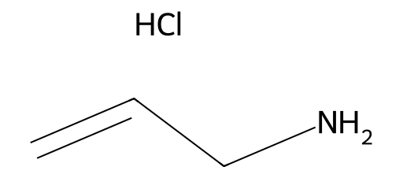

<!-- markdownlint-disable MD025 MD033 MD060 -->
# 亚精胺（Spermidine）

- [返回首页](../README.md)
- [1. 常见别名、物理性质、CAS编号、溶解度](#1-常见别名物理性质cas编号溶解度)
- [2. 化学性质、光热稳定性](#2-化学性质光热稳定性)
- [3. 生化特性](#3-生化特性)
- [4. 适应症、药理毒理](#4-适应症药理毒理)
- [5. 药代动力学、起效时间](#5-药代动力学起效时间)
- [6. 常见剂量、给药方式](#6-常见剂量给药方式)
- [7. 副作用、药物过量](#7-副作用药物过量)
- [8. 同分异构体与类似物](#8-同分异构体与类似物)
- [9. 在人体内整体作用](#9-在人体内整体作用)
- [10. 内分泌相关激素](#10-内分泌相关激素)
- [11. 对脂肪代谢](#11-对脂肪代谢)
- [12. 对血压的作用](#12-对血压的作用)
- [13. 对消化系统（急性）](#13-对消化系统急性)
- [14. 对神经系统的调节](#14-对神经系统的调节)
- [15. 对生殖系统](#15-对生殖系统)
- [16. 对皮肤的作用](#16-对皮肤的作用)
- [17. 过多或不足时的治疗](#17-过多或不足时的治疗)
- [18. 中医八纲辨证与五行归经](#18-中医八纲辨证与五行归经)

> 亚精胺是连接细胞更新、自噬、代谢与男性生殖健康的关键内源性多胺分子  
> 生理意义远大于传统营养补充剂

## 1. 常见别名、物理性质、CAS编号、溶解度

- 别名：亚精胺、N-(3-氨丙基)-1,4-丁二胺、Spermidine trihydrochloride（盐）
- 分子式：C₇H₁₉N₃
- 分子量：145.25
- CAS号
  - 游离碱：124-20-9
  - 三盐酸盐：334-50-9
- 外观：无色至淡黄色油状液体（游离碱），盐类为白色结晶
- 溶解度
  - 水：极易溶
  - 乙醇：可溶
  - 有机溶剂（乙醚、氯仿）：难溶
  - 生理条件下呈多价阳离子

## 2. 化学性质、光热稳定性

- 多胺结构，强碱性，可与DNA/RNA磷酸骨架结合
- 对光稳定
- 耐热性中等，>100℃开始缓慢分解
- 易与酸形成稳定盐（常见为三盐酸盐）

## 3. 生化特性

- 属于内源性多胺（polyamine）
- 与腐胺 → 亚精胺 → 精胺为同一代谢轴
- 参与
  - 染色质稳定
  - RNA翻译
  - 线粒体功能
  - 自噬调控（Autophagy）

## 4. 适应症、药理毒理

非传统药物，但具有明确生理作用

- 潜在适应方向（研究级）
  - 延缓衰老
  - 心血管保护
  - 抗炎
  - 改善代谢综合征
  - 精子发生支持
- 毒理学
  - 生理剂量安全
  - 大剂量可致：低血压、腹泻、迷走神经兴奋

## 5. 药代动力学、起效时间

- 吸收：小肠主动转运
- 血浆峰值：口服后 1–3 小时
- 分布：肝、肠道、前列腺、睾丸浓度较高
- 代谢：经多胺氧化酶（PAO）
- 排泄：尿液为主
- 起效
  - 细胞代谢调节：数小时
  - 功能改善（如精液参数）：2–6 周

## 6. 常见剂量、给药方式

- 口服补充（成年男性）
  - 保守剂量：1–3 mg / 日
  - 常用研究剂量：3–10 mg / 日
- 给药方式
  - 口服胶囊
  - 食源性摄入（更接近生理）

## 7. 副作用、药物过量

- 常见副作用（>10 mg/d）
  - 腹胀
  - 稀便
  - 面部潮红
- 明显过量
  - 血压下降
  - 心率减慢
  - 恶心、乏力

## 8. 同分异构体与类似物

- 腐胺：C4碳链，细胞增殖起始
- 亚精胺：C7碳链，自噬核心诱导
- 精胺：C10碳链，强DNA稳定
- 亚精胺类似物：多用于抗肿瘤研究
- 亚精胺是“生理活性最优平衡点”

## 9. 在人体内整体作用

- 提升细胞应激耐受
- 稳定染色体
- 改善线粒体效率
- 促进组织更新
- 对男性生殖系统尤为关键

## 10. 内分泌相关激素

- 不直接作为激素
- 间接影响
  - ↑ 睾酮信号敏感性
  - ↓ 炎症因子（IL-6、TNF-α）
  - ↑ 生长激素下游通路活性

## 11. 对脂肪代谢

- ↑ AMPK 活性
- ↑ 脂肪酸氧化
- ↓ 内脏脂肪炎症
- 不直接促进脂肪分解，但改善代谢效率

## 12. 对血压的作用

- 轻度降压趋势
- 机制
  - NO通路增强
  - 血管平滑肌松弛
- 低血压体质需慎用高剂量

## 13. 对消化系统（急性）

- 促进肠黏膜更新
- 刺激肠道蠕动
- 高剂量 → 腹泻、肠鸣

## 14. 对神经系统的调节

- 稳定神经元膜电位
- 抑制神经炎症
- 改善突触可塑性
- 与抗抑郁、自主神经稳定相关

## 15. 对生殖系统

- ↑ 精原细胞增殖
- ↑ 精子线粒体功能
- ↑ 精液体积与活力（间接）
- 前列腺组织中浓度高

## 16. 对皮肤的作用

- 促进角质形成细胞更新
- 抗氧化
- 改善屏障修复
- 外用多见于抗衰研究

## 17. 过多或不足时的治疗

- 不足：补充：亚精胺、富含多胺饮食
- 过多（极少见）：多胺合成抑制剂（如 DFMO，研究级）
- 非孕产期女性
  - 剂量更低
  - 对内分泌干扰更敏感
  - 更强调食源性补充

## 18. 中医八纲辨证与五行归经

- 性味：微温、甘
- 归经：肝、肾、脾
- 八纲：补而不燥、扶正固本
- 中医对应功效：补肾填精、生髓养脑、和中生化
