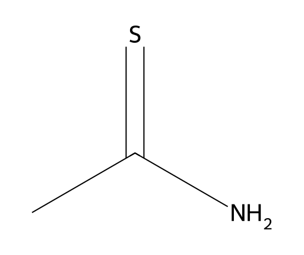

<!-- markdownlint-disable MD025 MD033 MD060 -->
# 硫代乙酰胺（TAA）

- [返回首页](../README.md)
- [1. 常见别名、物理性质、CAS编号、溶解度](#1-常见别名物理性质cas编号溶解度)
- [2. 化学性质、光热稳定性](#2-化学性质光热稳定性)
- [3. 生化特性](#3-生化特性)
- [4. 适应症、药理毒理](#4-适应症药理毒理)
- [5. 药代动力学、起效时间](#5-药代动力学起效时间)
- [6. 常见剂量、给药方式](#6-常见剂量给药方式)
- [7. 副作用、药物过量](#7-副作用药物过量)
- [8. 同分异构体与类似物](#8-同分异构体与类似物)
- [9. 在人体内整体作用](#9-在人体内整体作用)
- [10. 内分泌相关激素](#10-内分泌相关激素)
- [11. 对脂肪代谢](#11-对脂肪代谢)
- [12. 对血压的作用](#12-对血压的作用)
- [13. 对消化系统（急性）](#13-对消化系统急性)
- [14. 对神经系统的调节](#14-对神经系统的调节)
- [15. 对生殖系统](#15-对生殖系统)
- [16. 对皮肤的作用](#16-对皮肤的作用)
- [17. 过多或不足时的治疗](#17-过多或不足时的治疗)
- [18. 中医八纲辨证与五行归经](#18-中医八纲辨证与五行归经)

## 1. 常见别名、物理性质、CAS编号、溶解度

- 常见别名：Thioacetamide、TAA、Ethanethioamide、Acetothioamide
- CAS编号：62-55-5  
- 分子式：C₂H₅NS
- 分子量：75.14
- 外观：无色至淡黄色结晶
- 气味：轻度巯基/硫醇样臭味
- 密度：约 1.34 g/cm³
- 熔点：113–114°C  
- 溶解度
  - 水中25°C：163 g/L（16.3 g/100 mL），属于高度水溶。  
  - 乙醇：易溶
  - 苯、石油醚：可混溶
  - 乙醚：微溶  

## 2. 化学性质、光热稳定性

- 化学性质：属于硫代酰胺（thioamide）
- 主要反应
  - 1）水解（酸或碱条件）：CH₃CSNH₂ + H₂O → CH₃CONH₂ + H₂S
  - 进一步：CH₃CONH₂ → CH₃COOH + NH₃
  - 2）与重金属反应：可缓慢释放硫化氢，沉淀Pb²⁺、Cd²⁺、Zn²⁺
  - 因此常用于无机分析
- 光稳定性
  - 室温稳定
  - 强UV下逐渐氧化
- 热稳定性
  - 100°C开始分解
  - 酸碱均促进降解。  

## 3. 生化特性

- TAA本身毒性有限，是前毒物（pro-toxicant）
- 必须经肝脏代谢激活
  - 主要由：CYP2E1、CYP450
- 代谢：TAA -> TAA-S-oxide -> TAA-S,S-dioxide（终末活性毒性代谢物）
- 代谢物
  - 共价结合蛋白
  - 脂质过氧化
  - ROS暴增
  - 线粒体损伤

## 4. 适应症、药理毒理

- 无临床适应症，不是药物
- 主要用途
  - 肝纤维化模型
  - 肝硬化模型
  - 肝癌模型
  - 肾纤维化模型
- 急性毒理
  - 肝细胞坏死
  - 中心静脉周围坏死
- 慢性
  - 肝纤维化
  - 肝硬化
  - 胆管增生
  - 肝癌

## 5. 药代动力学、起效时间

- 吸收
  - 口服吸收快
  - 腹腔注射吸收近完全
- 分布
  - 肝浓度最高：liver > kidney > adrenal
- 起效
  - 单次：2–6小时出现氧化应激，12–24小时出现坏死
- 消除：肾排泄为主（代谢后）

## 6. 常见剂量、给药方式

- 腹腔注射：100–300 mg/kg
- 慢性模型：150–200 mg/kg，每周2–3次，连续6–12周
- 无人体治疗剂量

## 7. 副作用、药物过量

- 急性
  - 恶心
  - 呕吐
  - 腹痛
  - 黄疸
  - AST/ALT暴增
- 重度
  - 肝性脑病
  - 凝血障碍
  - 肝衰竭
- 长期
  - 肝癌风险

## 8. 同分异构体与类似物

- 类似物
  - cetamide
  - 氧代对应物
  - 毒性显著低
- Thiobenzamide
  - 肝毒性更强
  - 芳香族脂溶性更高
- Thiourea
  - 肝毒性较弱
  - 甲状腺毒性更明显

## 9. 在人体内整体作用

- 首先攻击肝脏
  - CYP活化
  - 谷胱甘肽耗竭
  - 脂质过氧化
- 然后
  - 炎症因子：TNF-α、IL-6、TGF-β
- 终末
  - stellate cell活化
  - collagen沉积
  - fibrosis

## 10. 内分泌相关激素

- 男性
  - 睾酮下降
  - SHBG升高
  - 雌二醇相对升高
  - IGF-1下降
- 机制：肝功能衰退继发

## 11. 对脂肪代谢

- 可导致
  - β氧化下降
  - 脂肪酸氧化抑制
  - 肝内TG堆积
- 形成
  - 脂肪肝

## 12. 对血压的作用

- 急性
  - 无直接作用
- 慢性肝损伤后
  - 门静脉高压
  - 外周低阻
  - 有效循环量下降

## 13. 对消化系统（急性）

- 数小时内
  - 食欲下降
  - 恶心
  - 呕吐
  - 胆汁分泌异常
  - 肝区疼痛

## 14. 对神经系统的调节

- 肝衰后
  - 血氨升高
  - 星形胶质细胞水肿
  - 肝性脑病
- 表现
  - 嗜睡
  - 认知下降
  - 扑翼样震颤

## 15. 对生殖系统

- 慢性暴露
  - 下丘脑-垂体-性腺轴抑制
- 导致
  - LH下降
  - 睾酮下降
  - 精子生成减少
- 属于继发性

## 16. 对皮肤的作用

- 肝损伤后
  - 黄疸
  - 瘙痒
  - 毛细血管扩张

## 17. 过多或不足时的治疗

- 无特效解毒剂
- 主要：解毒支持、N-Acetylcysteine、补充谷胱甘肽、Silymarin
- 实验支持：Lactulose、肝性脑病
- 重症：血浆置换、肝移植

## 18. 中医八纲辨证与五行归经

- 八纲：阳毒、热毒、湿热、瘀毒
- 五行：主伤木（肝）、次及土（脾胃）
- 归经：肝经、胆经、脾经
