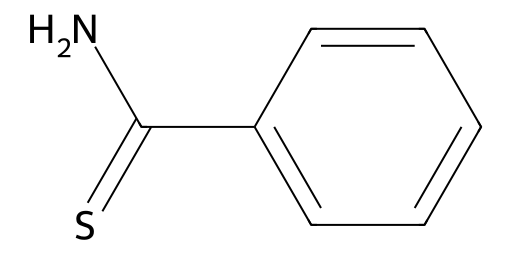

<!-- markdownlint-disable MD025 MD033 MD060 -->
# 硫代苯甲酰胺（Thiobenzamide）

- [返回首页](../README.md)
- [1. 常见别名、物理性质、CAS编号、溶解度](#1-常见别名物理性质cas编号溶解度)
- [2. 化学性质、光热稳定性](#2-化学性质光热稳定性)
- [3. 生化特性](#3-生化特性)
- [4. 适应症、药理毒理](#4-适应症药理毒理)
- [5. 药代动力学、起效时间](#5-药代动力学起效时间)
- [6. 常见剂量、给药方式](#6-常见剂量给药方式)
- [7. 副作用、药物过量](#7-副作用药物过量)
- [8. 同分异构体与类似物](#8-同分异构体与类似物)
- [9. 在人体内整体作用](#9-在人体内整体作用)
- [10. 内分泌相关激素](#10-内分泌相关激素)
- [11. 对脂肪代谢](#11-对脂肪代谢)
- [12. 对血压的作用](#12-对血压的作用)
- [13. 对消化系统（急性）](#13-对消化系统急性)
- [14. 对神经系统的调节](#14-对神经系统的调节)
- [15. 对生殖系统](#15-对生殖系统)
- [16. 对皮肤的作用](#16-对皮肤的作用)
- [17. 过多或不足时的治疗](#17-过多或不足时的治疗)
- [18. 中医八纲辨证与五行归经](#18-中医八纲辨证与五行归经)

## 1. 常见别名、物理性质、CAS编号、溶解度

- 中文名：硫代苯甲酰胺
- 英文名：Thiobenzamide
- IUPAC：Benzenecarbothioamide
- 别名：苯硫酰胺、苯甲硫酰胺、Benzothioamide
- CAS号：2227-79-4
- 分子式：C7H7NS
- 分子量：137.20
- 外观：白色至淡黄色结晶性粉末
- 气味：轻微硫醇样气味
- 熔点：约115–117°C（不同纯度略有差异）
- LogP：约1.5–1.8（中等脂溶性）
- 溶解度
  - 水中：0.5–2 g/L（不同晶型有差异）
  - 易溶于：乙醇、甲醇、丙酮、氯仿、DMSO
  - 微溶于：乙醚
  - 几乎不溶于：石油醚
  - 硫代酰胺类普遍表现出比对应氧代酰胺更高脂溶性

## 2. 化学性质、光热稳定性

- 主要反应
  - 水解（酸/碱条件）PhCSNH_2+H_2O\rightarrow PhCONH_2+H_2S
  - > 生成：苯甲酰胺、硫化氢
  - 氧化（过氧化氢、高锰酸钾）
  - > 生成：苯甲酰胺、苯甲酸
  - 金属配位，S原子可与Cu²⁺、Hg²⁺、Pd²⁺形成配合物
- 光热稳定性
  - 避光条件：稳定
  - 紫外线：缓慢氧化
  - 100°C：开始缓慢分解
  - 酸性高温：明显释放H2S

## 3. 生化特性

- 在体内属于“代谢活化型毒物”
- 经Cytochrome P450尤其
  - CYP2E1
  - CYP2B
- 代谢生成
  - thioamide S-oxide
  - reactive sulfur intermediates
- 这些代谢物可共价结合蛋白

## 4. 适应症、药理毒理

- 无临床批准用途
- 主要用于
  - 实验性肝损伤模型
  - 肝癌模型
  - 胆管损伤模型
- 毒理
  - 靶器官：肝脏、胆管、肾脏
  - 主要毒性：中心静脉坏死、胆管上皮增生、肝纤维化
- 与Thioacetamide毒性机制高度类似

## 5. 药代动力学、起效时间

- 吸收
  - 口服吸收良好
  - 腹腔注射吸收更快
- 分布：肝脏高度富集
- 代谢：肝脏P450氧化
- 半衰期：约1–3小时（实验数据）
- 起效
  - 2–6小时出现肝细胞损伤
  - 24小时达到峰值

## 6. 常见剂量、给药方式

- 口服：25–100 mg/kg
- 腹腔：10–50 mg/kg
- 慢性造模：每周2–3次、数周至数月

## 7. 副作用、药物过量

- 急性
  - 恶心
  - 呕吐
  - 嗜睡
  - 肝酶升高
- 严重
  - 黄疸
  - 肝坏死
  - 肝衰竭
- 慢性
  - 肝纤维化
  - 胆管增生
  - 肝硬化

## 8. 同分异构体与类似物

- Thioacetamide
  - 强肝毒性
  - 致癌性更明确
- Thiourea
  - 甲状腺毒性明显
  - 抑制甲状腺激素合成
- 苯甲酰胺
  - 氧代类似物
  - 毒性显著更低

## 9. 在人体内整体作用

- 初期
  - 肝P450活化
  - ROS增加
  - 谷胱甘肽消耗
- 中期
  - 线粒体损伤
  - ATP下降
  - 细胞坏死
- 后期
  - 炎症
  - 成纤维细胞激活
  - ECM沉积
- 最终
  - 可发展为实验性肝硬化

## 10. 内分泌相关激素

- 肝损伤后，可影响
  - 睾酮代谢
  - 雌激素灭活
  - IGF-1生成
- 因此慢性暴露可能导致
  - 血睾酮下降
  - 雌激素相对升高

## 11. 对脂肪代谢

- 肝损伤后
  - β氧化下降
  - VLDL分泌减少
  - 甘油三酯堆积
- 可能出现脂肪肝样改变

## 12. 对血压的作用

- 严重肝损伤后
  - 门静脉高压
  - 外周血管扩张
  - 低血压

## 13. 对消化系统（急性）

- 食欲下降
- 恶心
- 呕吐
- 胆汁淤积
- 肝区疼痛

## 14. 对神经系统的调节

- 肝功能受损后
  - 血氨升高
  - GABA增强
  - 谷氨酸失衡
- 严重可出现
  - 肝性脑病

## 15. 对生殖系统

- 慢性暴露可能
  - 睾酮下降
  - 精子生成减少
  - 性欲下降
- 机制主要为肝功能障碍继发

## 16. 对皮肤的作用

- 黄疸
- 瘙痒（胆汁淤积）
- 慢性氧化应激导致皮肤暗沉

## 17. 过多或不足时的治疗

- 支持治疗包括
  - N-Acetylcysteine
  - 补充谷胱甘肽前体
- 保肝
  - Silibinin
  - Ursodeoxycholic Acid
- 重症
  - 血液净化
  - 肝移植

## 18. 中医八纲辨证与五行归经

- 八纲：里证、热证、实证、阳毒
- 五行：肝（木）、脾（土）
- 表现：肝郁化火、湿热内蕴、瘀毒阻络
