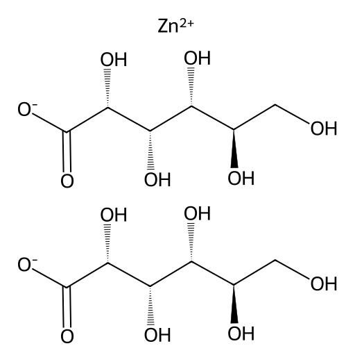

<!-- markdownlint-disable MD025 MD033 MD060 -->
# 葡萄糖酸锌（Zinc Gluconate）

- [返回首页](../README.md)
- 另请参见：**[硫酸镁](./Functional_Reshaping_Records/MgSO4.md)** | **[硫酸锌](./Functional_Reshaping_Records/ZnSO4.md)**
- [1. 常见别名、物理性质、CAS编号、溶解度](#1-常见别名物理性质cas编号溶解度)
- [2. 化学性质、光热稳定性](#2-化学性质光热稳定性)
- [3. 生化特性](#3-生化特性)
- [4. 适应症、药理毒理](#4-适应症药理毒理)
- [5. 药代动力学、起效时间](#5-药代动力学起效时间)
- [6. 常见剂量、给药方式](#6-常见剂量给药方式)
- [7. 副作用、药物过量](#7-副作用药物过量)
- [8. 同分异构体与类似物](#8-同分异构体与类似物)
- [9. 在人体内整体作用](#9-在人体内整体作用)
- [10. 内分泌相关激素](#10-内分泌相关激素)
- [11. 对脂肪代谢](#11-对脂肪代谢)
- [12. 对血压的作用](#12-对血压的作用)
- [13. 对消化系统（急性）](#13-对消化系统急性)
- [14. 对神经系统的调节](#14-对神经系统的调节)
- [15. 对生殖系统](#15-对生殖系统)
- [16. 对皮肤的作用](#16-对皮肤的作用)
- [17. 过多或不足时的治疗](#17-过多或不足时的治疗)
- [18. 中医八纲辨证与五行归经](#18-中医八纲辨证与五行归经)

## 1. 常见别名、物理性质、CAS编号、溶解度

- 中文名：葡萄糖酸锌
- 英文名：Zinc Gluconate
- CAS号：4468-02-4
- 分子式：C₁₂H₂₂O₁₄Zn
- 分子量：≈455.7
- 常见别名：葡萄糖酸锌盐、锌葡萄糖酸盐
- 外观：白色或类白色结晶性粉末
- 气味：无臭
- 味道：微涩
- 熔点：约131℃（分解）
- 水溶性：易溶于水（约100 g/L以上，室温）
- 有机溶剂：几乎不溶于乙醇、乙醚、氯仿
- 水溶液pH：约5.5–7.5（取决于浓度）

## 2. 化学性质、光热稳定性

- 为弱酸（葡萄糖酸）与二价锌形成的配位盐
- 水溶液中部分解离为Zn²⁺与葡萄糖酸根
- 遇强碱生成Zn(OH)₂沉淀
- 与强酸反应生成相应锌盐
- 光稳定性：对光基本稳定
- 热稳定性：加热至高温分解
- 吸湿性较低

## 3. 生化特性

- 锌为人体必需微量元素
- 参与300余种酶活性（如碳酸酐酶、DNA聚合酶）
- 参与蛋白质合成、核酸代谢
- 调节免疫功能
- 抗氧化作用（通过Cu/Zn-SOD）

## 4. 适应症、药理毒理

- 适应症
  - 锌缺乏症
  - 儿童生长迟缓
  - 免疫功能低下
  - 痤疮辅助治疗
  - 男性性腺功能减退的辅助治疗
  - 急性腹泻（WHO推荐补锌）
- 药理作用
  - 提高免疫细胞活性
  - 稳定细胞膜
  - 抗炎
  - 促进睾酮合成（间接）
- 毒理
  - 急性毒性低
  - 过量可致胃肠刺激
  - 长期高剂量可导致铜缺乏

## 5. 药代动力学、起效时间

- 吸收部位：小肠（十二指肠为主）
- 生物利用度：20–40%（受食物影响大）
- 与血浆蛋白结合率高（主要与白蛋白）
- 分布：骨骼、肌肉、前列腺、睾丸
- 起效时间：数天至1周（改善缺锌症状）
- 达稳态时间：约7–14天
- 排泄：主要经粪便，少量经尿

## 6. 常见剂量、给药方式

- 成人补锌：每日15–30 mg元素锌
- 治疗缺锌：每日30–50 mg元素锌
- 给药方式：口服（片剂、含片、糖浆）
- 含片用于感冒早期

## 7. 副作用、药物过量

- 常见不良反应
  - 恶心
  - 呕吐
  - 腹痛
  - 金属味
- 长期大剂量（>100 mg/天元素锌）
  - 铜缺乏性贫血
  - 免疫抑制
  - HDL下降

## 8. 同分异构体与类似物

- 硫酸锌（溶解度更高，胃刺激性强）
- 醋酸锌（含片常用）
- 乳酸锌
- 生化作用本质相同，差别主要在吸收耐受性

## 9. 在人体内整体作用

- 维持内分泌稳态
- 支持睾酮合成
- 维持精子发生
- 抗氧化
- 促进创伤愈合

## 10. 内分泌相关激素

- 促进睾丸Leydig细胞功能
- 参与LH受体信号转导
- 抑制芳香化酶过度活性（轻度）
- 与胰岛素储存释放相关

## 11. 对脂肪代谢

- 轻度改善胰岛素敏感性
- 可能降低氧化LDL
- 长期高剂量可能降低HDL

## 12. 对血压的作用

- 轻度改善血管内皮功能
- 缺锌与高血压相关
- 补锌对正常人血压影响较小

## 13. 对消化系统（急性）

- 刺激胃黏膜
- 空腹易恶心
- 可改善腹泻

## 14. 对神经系统的调节

- 参与NMDA受体调节
- 参与GABA调节
- 抗氧化神经保护
- 过量可引起头痛

## 15. 对生殖系统

- 提高精子数量与活力
- 改善精液质量
- 支持睾酮生成
- 缺锌可致性欲下降

## 16. 对皮肤的作用

- 抗炎
- 改善痤疮
- 促进伤口愈合

## 17. 过多或不足时的治疗

- 锌缺乏
  - 首选：口服葡萄糖酸锌或硫酸锌
  - 重度：静脉补锌
- 锌过量
  - 停药
  - 补充铜
  - 对症支持
- 非孕产期女性治疗剂量基本相同，但注意月经期铁铜平衡

## 18. 中医八纲辨证与五行归经

- 性味：甘、微涩、平
- 归经：肾、脾
- 功能类比：补肾益精、固涩止泻
- 五行：属金（水之母）
- 偏虚证：肾精不足、脾虚泄泻
- 实证：过量则伤脾胃
