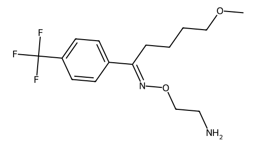

<!-- markdownlint-disable MD025 MD033 MD060 -->
# 氟伏杀明（Fluvoxamine）

- [返回首页](../README.md)，另请参加：[SSRI药物对比](../../Hormonal_Balance_Compendium/Shimmering_Healing_Chronicles/Comparison_of_SSRI.md)
- [1. 常见别名、物理性质、CAS编号、溶解度](#1-常见别名物理性质cas编号溶解度)
- [2. 化学性质、光热稳定性](#2-化学性质光热稳定性)
- [3. 生化特性](#3-生化特性)
- [4. 适应症、药理毒理](#4-适应症药理毒理)
- [5. 药代动力学、起效时间](#5-药代动力学起效时间)
- [6. 常见剂量、给药方式](#6-常见剂量给药方式)
- [7. 副作用、药物过量](#7-副作用药物过量)
- [8. 同分异构体与类似物](#8-同分异构体与类似物)
- [9. 在人体内整体作用](#9-在人体内整体作用)
- [10. 内分泌相关激素](#10-内分泌相关激素)
- [11. 对脂肪代谢](#11-对脂肪代谢)
- [12. 对血压的作用](#12-对血压的作用)
- [13. 对消化系统（急性）](#13-对消化系统急性)
- [14. 对神经系统的调节](#14-对神经系统的调节)
- [15. 对生殖系统](#15-对生殖系统)
- [16. 对皮肤的作用](#16-对皮肤的作用)
- [17. 过多或不足时的治疗](#17-过多或不足时的治疗)
- [18. 中医八纲辨证与五行归经](#18-中医八纲辨证与五行归经)

> 氟伏沙明在SSRI中具有两个显著特点：对强迫症疗效突出（首选药之一），σ1受体激动作用明显（抗焦虑与认知改善更强），但其CYP抑制作用强（药物相互作用多），临床使用需特别注意

## 1. 常见别名、物理性质、CAS编号、溶解度

- 常见别名：氟伏沙明、氟伏沙明马来酸盐
- 英文名：Fluvoxamine maleate
- CAS编号：54739-18-3（游离碱），61718-82-9（马来酸盐）
- 分子式：C15H21F3N2O2（游离碱）
- 白色或类白色结晶粉末
- 熔点：约120–140°C（盐形式）
- 水溶性：中等（盐形式较高）
- 溶解性
  - 水：可溶（马来酸盐）
  - 乙醇：易溶
  - 氯仿：中等
  - 有机溶剂（如甲醇、乙腈）：良好

## 2. 化学性质、光热稳定性

- 含有三氟甲基苯环 + 醚键 + 胺结构
- 化学稳定性：常温稳定
- 光稳定性：对光较敏感，长期暴露可能降解
- 热稳定性：常规储存稳定，避免高温
- 在酸性环境下较稳定（盐形式）

## 3. 生化特性

- 选择性5-羟色胺再摄取抑制剂（SSRI）
- 对SERT（5-HT转运体）高亲和力
- 对NE、DA转运体几乎无作用
- 具有一定σ1受体激动作用（区别于其他SSRI的重要特性）

## 4. 适应症、药理毒理

- 适应症
  - 强迫症（OCD）——首选之一
  - 抑郁症
  - 焦虑障碍（社交焦虑、惊恐）
- 药理作用
  - ↑突触间5-HT浓度
  - σ1受体激动 → 抗焦虑、改善认知
- 毒理
  - 低心脏毒性（优于三环类）
  - 过量可导致：5-HT综合征、CNS抑制或兴奋

## 5. 药代动力学、起效时间

- 口服生物利用度：约50%
- 蛋白结合率：约80%
- 代谢：肝脏（强抑制CYP1A2、CYP2C19）
- 半衰期：约15–22小时
- 起效时间
  - 抗焦虑：1–2周
  - 抗抑郁：2–4周
  - OCD：4–6周

## 6. 常见剂量、给药方式

- 起始剂量：50 mg/日
- 常用剂量：100–200 mg/日
- 最大剂量：300 mg/日
- 给药方式：口服（通常分次或夜间服用）

## 7. 副作用、药物过量

- 常见副作用
  - 胃肠道：恶心、腹泻
  - 中枢：失眠或嗜睡
  - 性功能障碍（较明显）
  - 出汗增加
- 过量表现
  - 嗜睡、昏迷
  - 心动过速
  - 罕见QT延长
  - 严重：5-HT综合征

## 8. 同分异构体与类似物

- 无临床意义的手性拆分制剂
- 类似物
  - 氟西汀（半衰期长）
  - 舍曲林（多巴胺作用轻微）
  - 艾司西酞普兰（更高选择性）
- 生化差异
  - 氟伏沙明：σ1激动最突出
  - 氟西汀：5-HT + 轻度NE作用
  - 舍曲林：轻度DAT抑制

## 9. 在人体内整体作用

- 提高情绪稳定性
- 减少强迫行为
- 降低焦虑警觉性
- 对认知（注意力、反刍思维）有改善

## 10. 内分泌相关激素

- ↑泌乳素（轻度）
- 睾酮降低（长期可能轻度抑制）
- ↑皮质醇调节稳定性

## 11. 对脂肪代谢

- 短期
  - 无明显影响
- 长期
  - 体重变化较小（中性或轻微增加）
  - 可能通过5-HT影响食欲

## 12. 对血压的作用

- 一般无明显影响
- 少数
  - 轻度低血压
  - 焦虑改善后血压下降

## 13. 对消化系统（急性）

- 5-HT3相关
  - 恶心（最常见）
  - 胃动力改变
- 长期适应后减轻

## 14. 对神经系统的调节

- ↑5-HT → 抑制杏仁核过度兴奋
- σ1受体 →
  - 神经保护
  - 抗焦虑
  - 改善神经可塑性
- 下调强迫环路（皮质-纹状体通路）

## 15. 对生殖系统

- 性欲降低
- 延迟射精（常见）
- 勃起功能轻度抑制（较少）
- 机制
  - 5-HT2C激活 → 抑制性行为
  - 多巴胺释放下降

## 16. 对皮肤的作用

- 出汗增加
- 罕见皮疹
- 极罕见：药疹或光敏

## 17. 过多或不足时的治疗

- 过量
  - 对症支持治疗
  - 苯二氮卓类控制激越
  - 严重5-HT综合征：赛庚啶
- 不足/疗效差
  - 增量或换药（如舍曲林、艾司西酞普兰）
- 女性对SSRI敏感性通常略高 → 剂量相对较低

## 18. 中医八纲辨证与五行归经

- 八纲辨证
  - 属“郁证”“心神不宁”
  - 偏“虚实夹杂”
- 五行归经
  - 心（主神志）
  - 肝（主疏泄）
- 作用类比
  - 疏肝解郁
  - 养心安神
