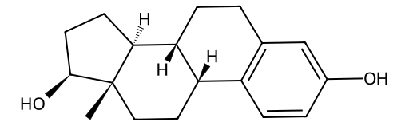

<!-- markdownlint-disable MD025 MD033 MD060 -->
# 雌二醇（E2）

- [返回首页](../README.md)
- 另外参见：**[各系统作用](../../Hormonal_Balance_Compendium/Vitality_Flow_Insights/E2_Effect.md)**
- [1. 常见别名、物理性质、CAS编号、溶解度](#1-常见别名物理性质cas编号溶解度)
- [2. 化学性质、光热稳定性](#2-化学性质光热稳定性)
- [3. 生化特性](#3-生化特性)
- [4. 适应症、药理毒理](#4-适应症药理毒理)
- [5. 药代动力学、起效时间](#5-药代动力学起效时间)
- [6. 常见剂量、给药方式](#6-常见剂量给药方式)
- [7. 副作用、药物过量](#7-副作用药物过量)
- [8. 同分异构体与类似物](#8-同分异构体与类似物)
- [9. 在人体内整体作用](#9-在人体内整体作用)
- [10. 内分泌相关激素](#10-内分泌相关激素)
- [11. 对脂肪代谢](#11-对脂肪代谢)
- [12. 对血压的作用](#12-对血压的作用)
- [13. 对消化系统（急性）](#13-对消化系统急性)
- [14. 对神经系统的调节](#14-对神经系统的调节)
- [15. 对生殖系统](#15-对生殖系统)
- [16. 对皮肤的作用](#16-对皮肤的作用)
- [17. 过多或不足时的治疗](#17-过多或不足时的治疗)
- [18. 中医八纲辨证与五行归经](#18-中医八纲辨证与五行归经)

> 雌二醇在男性体内并非“女性激素”  
> 骨代谢核心调节因子  
> 性腺轴负反馈关键节点  
> 神经与代谢的重要调节激素  
> 其最重要特征是：必须维持在狭窄范围内，过高或过低均会产生明显系统性影响  

## 1. 常见别名、物理性质、CAS编号、溶解度

- 常见别名：17β-雌二醇、E2、β-雌二醇
- CAS编号：50-28-2
- 分子式：C₁₈H₂₄O₂
- 分子量：272.38 g/mol
- 白色或类白色结晶性粉末
- 熔点：≈173–179°C
- 溶解度
  - 水：极微溶（≈3–5 µg/L）
  - 乙醇、甲醇：易溶
  - 油脂（如植物油）：高度溶解
  - 脂溶性强，亲脂性高

## 2. 化学性质、光热稳定性

- 类固醇结构（芳香A环）
- 易被氧化为雌酮（E1）
- 光敏性：紫外光下降解
- 热稳定性：中等，长期加热可降解
- 在碱性条件下较不稳定

## 3. 生化特性

- 主要由睾酮经**芳香化酶（CYP19A1）**转化
- 与**雌激素受体（ERα、ERβ）**结合
- 调控基因转录（核受体机制）
- 亦存在快速非基因组效应（膜受体）

## 4. 适应症、药理毒理

- 男性中主要作用
  - 骨密度维持（关键）
  - 精子发生调节
  - 中枢性欲调节
- 临床用途（广义）
  - 激素替代治疗（女性）
  - 跨性别激素治疗
  - 前列腺癌辅助治疗（历史上使用）
- 毒理
  - 高水平→血栓风险↑
  - 长期过量→乳腺组织增生

## 5. 药代动力学、起效时间

- 口服生物利用度
  - 低（首过效应显著）
- 常见给药
  - 经皮、肌注、舌下
- 起效时间
  - 舌下：30–60 min
  - 经皮：数小时
- 半衰期
  - 约1–2小时（口服），但效应更长（受体作用）

## 6. 常见剂量、给药方式

- 生理水平：20–40 pg/mL（成年男性）
- 药用（跨性别）：2–6 mg/d（口服等效）
- 给药方式
  - 口服片
  - 经皮贴片/凝胶
  - 注射（戊酸酯等）

## 7. 副作用、药物过量

- 副作用（男性）
  - 男性乳腺发育（gynecomastia）
  - 性欲下降（过高时）
  - 水钠潴留
  - 血栓形成风险↑
- 过量表现
  - 情绪波动
  - 性功能抑制
  - 乳房压痛

## 8. 同分异构体与类似物

- 雌酮（E1）：活性较弱，可转化为E2
- 雌三醇（E3）：活性最低
- 炔雌醇（Ethinylestradiol）：口服活性更强（抗代谢）

## 9. 在人体内整体作用

- 骨骼：防止骨质疏松
- 中枢：参与情绪与认知
- 生殖轴：负反馈抑制GnRH

## 10. 内分泌相关激素

- 抑制
  - GnRH（下丘脑）
  - LH、FSH（垂体）
- 来源
  - 外周脂肪组织
  - 睾丸（少量）

## 11. 对脂肪代谢

- 抑制内脏脂肪积累
- 增强胰岛素敏感性（适度水平）
- 过高：可能促进脂肪重新分布（女性化）

## 12. 对血压的作用

- 低剂量
  - 血管扩张（NO释放↑）
- 高剂量
  - 可能升高血压（RAAS激活）
  - 血栓风险增加

## 13. 对消化系统（急性）

- 轻度影响：恶心（口服时常见）
- 肝脏：增加凝血因子合成

## 14. 对神经系统的调节

- 增强5-HT（血清素）活性
- 多巴胺调节
- 作用
  - 改善情绪（适度）
  - 过高→情绪不稳

## 15. 对生殖系统

- 抑制睾酮生成（负反馈）
- 精子生成需要适量E2
- 过高
  - 精子减少
  - 睾丸功能抑制

## 16. 对皮肤的作用

- 增加皮肤厚度与水合
- 减少皮脂分泌
- 促进胶原合成

## 17. 过多或不足时的治疗

- 过高（男性）
  - 芳香化酶抑制剂：阿那曲唑、来曲唑
  - 选择性雌激素受体调节剂（SERM）：他莫昔芬
- 过低
  - 极少单独补充
  - 通常通过提高睾酮间接恢复

## 18. 中医八纲辨证与五行归经

- 归经：肝、肾
- 五行：属木（水生木）
- 作用类比：类似“阴血”
- 过多：肝郁、痰湿、瘀血
- 不足：肝肾阴虚，骨弱、情绪波动
