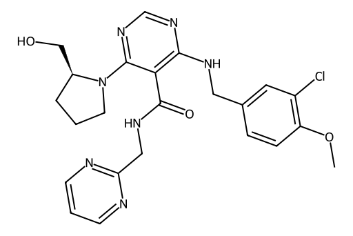

<!-- markdownlint-disable MD025 MD033 MD060 -->
# 阿伐那非（Avanafil）

- [返回首页](../README.md)
- 另请参阅：[PDE5抑制剂对比](../../Hormonal_Balance_Compendium/Vitality_Source_Notes/PDE5_Compress.md)
- [1. 常见别名、物理性质、CAS编号、溶解度](#1-常见别名物理性质cas编号溶解度)
- [2. 化学性质、光热稳定性](#2-化学性质光热稳定性)
- [3. 生化特性](#3-生化特性)
- [4. 适应症、药理毒理](#4-适应症药理毒理)
- [5. 药代动力学、起效时间](#5-药代动力学起效时间)
- [6. 常见剂量、给药方式](#6-常见剂量给药方式)
- [7. 副作用、药物过量](#7-副作用药物过量)
- [8. 同分异构体与类似物](#8-同分异构体与类似物)
- [9. 在人体内整体作用](#9-在人体内整体作用)
- [10. 内分泌相关激素](#10-内分泌相关激素)
- [11. 对脂肪代谢](#11-对脂肪代谢)
- [12. 对血压的作用](#12-对血压的作用)
- [13. 对消化系统（急性）](#13-对消化系统急性)
- [14. 对神经系统的调节](#14-对神经系统的调节)
- [15. 对生殖系统](#15-对生殖系统)
- [16. 对皮肤的作用](#16-对皮肤的作用)
- [17. 过多或不足时的治疗](#17-过多或不足时的治疗)
- [18. 中医八纲辨证与五行归经](#18-中医八纲辨证与五行归经)

> 阿伐那非是当前PDE5抑制剂中，起效最快，选择性最高，副作用最轻的一类  
> 适合：需要即刻反应的ED患者，对西地那非不耐受者  

## 1. 常见别名、物理性质、CAS编号、溶解度

- 常见别名：Avanafil、TA-1790
- CAS编号：83050-13-5
- 分子式：C23H26ClN7O3
- 分子量：483.95 g/mol
- 白色至类白色结晶粉末
- 熔点：约 200–205°C
- 溶解度
  - 水：极低溶解（<1 mg/mL）
  - 有机溶剂：易溶于DMSO、乙醇、甲醇
  - pH依赖：弱碱性环境溶解性略增加

## 2. 化学性质、光热稳定性

- 属于吡唑并嘧啶类PDE5抑制剂
- 化学稳定性
  - 常温干燥条件稳定
  - 对强光略敏感（光降解较慢）
  - 在强酸/强碱环境下可能水解
- 热稳定性
  - 中等（>180°C开始分解）

## 3. 生化特性

- 高选择性抑制PDE5（磷酸二酯酶5）
- 对PDE6（视网膜）抑制较弱 → 视觉副作用较少
- 作用机制
  - 抑制cGMP降解 → cGMP↑
  - 平滑肌松弛 → 海绵体血流增加

## 4. 适应症、药理毒理

- 适应症
  - 勃起功能障碍（ED）
- 药理作用
  - 增强NO–cGMP通路
  - 必须有性刺激才起效
- 毒理
  - 急性毒性低
  - 高剂量
  - 血压下降
  - 心率反射性升高

## 5. 药代动力学、起效时间

- 起效时间：约 15–30分钟（同类中最快）
- 达峰时间（Tmax）：30–45分钟
- 半衰期（t½）：约 5小时
- 生物利用度：中等
- 代谢：主要经CYP3A4
- 排泄：粪便为主

## 6. 常见剂量、给药方式

- 推荐剂量：100 mg（起始）
- 调整范围：50–200 mg
- 给药方式：口服，性活动前15–30分钟
- 食物影响：高脂餐轻度延迟吸收

## 7. 副作用、药物过量

- 常见副作用
  - 头痛
  - 面部潮红
  - 鼻塞
  - 轻度头晕
- 少见
  - 低血压
  - 心悸
  - 阴茎异常勃起
- 过量
  - 严重低血压
  - 需支持治疗（无特效解毒剂）

## 8. 同分异构体与类似物

- 类似PDE5抑制剂
  - 西地那非：起效较慢、视觉副作用明显
  - 他达拉非：半衰期长（17.5h）
  - 伐地那非：效力强但心电影响略大
- 特点对比：阿伐那非选择性最高、起效最快、副作用相对最轻

## 9. 在人体内整体作用

- 局部（海绵体）
  - 平滑肌松弛
  - 动脉扩张
- 全身
  - 轻度血管扩张
  - 血压轻微下降

## 10. 内分泌相关激素

- 无直接影响
  - 睾酮
  - LH / FSH
- 间接
  - 性行为增加 → 睾酮短暂波动

## 11. 对脂肪代谢

- 基本无直接作用
- 长期改善性生活可能间接改善代谢状态

## 12. 对血压的作用

- 轻度降低收缩压/舒张压
- 与硝酸酯类联用 → 严重低血压风险

## 13. 对消化系统（急性）

- 轻微
  - 消化不良
  - 胃部不适
- 无明显肝毒性（常规剂量）

## 14. 对神经系统的调节

- 无直接中枢兴奋作用
- 通过外周血流改善 → 性反应增强
- 头痛机制：脑血管扩张

## 15. 对生殖系统

- 增强勃起硬度与维持时间
- 不直接增加精液量
- 不影响精子质量（短期）

## 16. 对皮肤的作用

- 面部潮红（血管扩张）
- 少数皮疹（过敏）

## 17. 过多或不足时的治疗

- 不足（疗效差）
  - 增加剂量（至200 mg）
  - 更换为他达拉非（长效）
- 过量
  - 对症处理
  - 避免使用硝酸酯
- 女性对比
  - 女性无适应症
  - PDE5抑制剂在女性中疗效不明确

## 18. 中医八纲辨证与五行归经

- 八纲：阳虚夹瘀
- 五行归经
  - 肾经（主性功能）
  - 肝经（疏泄）
- 作用理解
  - 温阳活血
  - 改善肾阳不足、气血瘀滞型阳痿
