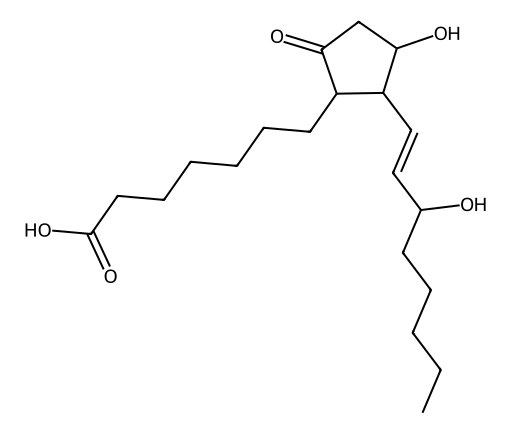

<!-- markdownlint-disable MD025 MD033 MD060 -->
# 前列地尔（PGE1）

- [返回首页](../README.md)
- 另请参见：[溶剂配置](../../Hormonal_Balance_Compendium/Vitality_Source_Notes/PGE1_Dissolution.md)
- [1. 常见别名、物理性质、CAS编号、溶解度](#1-常见别名物理性质cas编号溶解度)
- [2. 化学性质、光热稳定性](#2-化学性质光热稳定性)
- [3. 生化特性](#3-生化特性)
- [4. 适应症、药理毒理](#4-适应症药理毒理)
- [5. 药代动力学、起效时间](#5-药代动力学起效时间)
- [6. 常见剂量、给药方式](#6-常见剂量给药方式)
- [7. 副作用、药物过量](#7-副作用药物过量)
- [8. 同分异构体与类似物](#8-同分异构体与类似物)
- [9. 在人体内整体作用](#9-在人体内整体作用)
- [10. 内分泌相关激素](#10-内分泌相关激素)
- [11. 对脂肪代谢](#11-对脂肪代谢)
- [12. 对血压的作用](#12-对血压的作用)
- [13. 对消化系统（急性）](#13-对消化系统急性)
- [14. 对神经系统的调节](#14-对神经系统的调节)
- [15. 对生殖系统](#15-对生殖系统)
- [16. 对皮肤的作用](#16-对皮肤的作用)
- [17. 过多或不足时的治疗](#17-过多或不足时的治疗)
- [18. 中医八纲辨证与五行归经](#18-中医八纲辨证与五行归经)

- 前列地尔是天然前列腺素E1（Prostaglandin E1，PGE1）的药物形式，属于直接扩张血管和平滑肌松弛药，也是目前治疗勃起功能障碍最经典的局部用药之一

## 1. 常见别名、物理性质、CAS编号、溶解度

- 通用名：前列地尔、Alprostadil
- 别名：PGE1、前列腺素E1
- CAS编号：745-65-3
- 分子式：C20H34O5
- 分子量：354.48
- 白色或类白色粉末
- 对热、光、氧均较敏感
- 溶解度
  - 水中：微溶（约0.1～1 mg/mL，受pH影响）
  - 乙醇：易溶
  - 甲醇：易溶
  - DMSO：极易溶解
  - 丙二醇：易溶
  - 植物油：可溶
  - 脂溶性较强

## 2. 化学性质、光热稳定性

- 化学性质
  - 属于二十碳脂肪酸衍生物
- 具有
  - 一个羧基
  - 一个酮基
  - 两个羟基
  - 两个双键
- 容易发生
  - 氧化
  - 异构化
  - 水解
- 光稳定性
  - 很差
  - 紫外线可迅速降解
- 热稳定性
  - 室温长期保存即可逐渐失活
- 一般要求
  - 冷藏（2～8°C）
  - 避光
- 冻干粉稳定性明显高于溶液

## 3. 生化特性

- 主要受体
  - EP2
  - EP4
  - 少量EP1
  - 少量EP3
- 主要作用机制
  - 激活Gs蛋白 →
  - Adenylate Cyclase上升 →
  - cAMP上升 →
  - PKA上升 →
  - Ca²⁺下降
- 最终导致
  - 平滑肌松弛
  - 血管扩张
  - 血流增加

## 4. 适应症、药理毒理

- 主要适应症
  - 勃起功能障碍（ED）
  - 新生儿动脉导管依赖性心脏病（维持动脉导管开放）
  - 外周血管疾病（部分国家）
- 药理作用
  - 海绵体平滑肌松弛
  - 动脉扩张
  - 抑制血小板聚集
  - 改善微循环
- 毒理
  - 总体毒性较低
  - 不会像PDE5抑制剂那样产生明显全身低血压

## 5. 药代动力学、起效时间

- 尿道给药（MUSE）
  - 起效：5～15分钟
  - 峰值：15～30分钟
  - 持续：30～90分钟
  - 生物利用度：约10%左右
- 海绵体注射（ICI）
  - 起效：3～10分钟
  - 峰值：10～20分钟
  - 持续：30～90分钟
  - 部分患者可持续2小时以上
- 静脉给药
  - 半衰期：约5～10分钟
  - 肺循环即可代谢约80%

## 6. 常见剂量、给药方式

- 尿道给药：125 μg，250 μg，500 μg，1000 μg
- 海绵体注射
  - 初始：2.5 μg
  - 逐渐增加：5 μg，10 μg，20 μg，40 μg
- 多数患者：5～20 μg即可
- 静脉输注
  - 主要用于新生儿：0.01～0.1 μg/kg/min
  - 成人极少使用

## 7. 副作用、药物过量

- 尿道给药，常见
  - 尿道烧灼感
  - 尿道疼痛
  - 少量出血
- 海绵体注射，常见
  - 注射疼痛
  - 局部血肿
  - 阴茎疼痛
  - 海绵体纤维化（长期反复使用）
- 严重
  - 异常持续勃起（超过4小时）
  - 海绵体缺血
  - 极少发生阴茎坏死

## 8. 同分异构体与类似物

- 与前列地尔作用机制相近
  - 米索前列醇（PGE1类似物）
  - 依前列醇（PGI2）
  - 伊洛前列素（PGI2类似物）
  - 曲前列尼尔（PGI2类似物）
- 其中，仅前列地尔广泛用于勃起功能障碍治疗

## 9. 在人体内整体作用

- 心血管
  - 外周阻力下降
  - 局部血流增加
- 微循环
  - 毛细血管灌注增加
- 肾脏
  - 肾血流略增加
- 肺
  - 可降低肺动脉压力
- **海绵体**
  - 松弛小梁平滑肌
  - 扩张海绵体动脉
  - 增加静脉闭合效应
  - 促进勃起

## 10. 内分泌相关激素

- 前列地尔**不是激素**
- 一般不会明显影响
  - 睾酮
  - 雌二醇
  - 黄体生成素（LH）
  - 卵泡刺激素（FSH）
  - 泌乳素
- 它主要通过局部血管和平滑肌作用发挥效果，而非调节性腺轴

## 11. 对脂肪代谢

- 影响很小
- 长期治疗不会明显改变
  - LDL
  - HDL
  - 甘油三酯
  - 胆固醇

## 12. 对血压的作用

- 局部给药
  - 几乎无影响
- 静脉给药
  - 血压下降
  - 心率反射性增快

# 13. 对消化系统（急性）

- 偶见
  - 恶心
  - 腹泻
  - 腹部不适
- 远少于其他前列腺素类药物

## 14. 对神经系统的调节

- 不直接作用于中枢神经系统
- 其促勃起作用**不依赖性欲或中枢神经兴奋**，而是通过局部提高海绵体血流实现
- 因此，即使神经源性勃起功能障碍患者，也可能对海绵体注射前列地尔产生反应

## 15. 对生殖系统

- 男性
  - 扩张阴茎海绵体动脉
  - 松弛海绵体平滑肌
  - 改善勃起硬度
  - 对精子生成、精液量和性激素水平无直接影响
- 女性
  - 可增加局部血流，但无成熟、常规的妇科适应症

## 16. 对皮肤的作用

- 局部可能出现
  - 发红
  - 温热感
  - 疼痛
  - 瘀斑（注射时）
- 无促进皮肤修复或美容方面的临床用途

## 17. 过多或不足时的治疗

- 由于前列地尔属于外源性药物，人体不存在“前列地尔缺乏症”
- 过量使用（尤其海绵体注射）导致异常持续勃起时，应尽快就医。
- 标准处理包括海绵体穿刺抽吸积血，必要时海绵体内注射血管收缩药（如去氧肾上腺素），以恢复静脉回流并降低缺血风险

## 18. 中医八纲辨证与五行归经

- 性味：偏温通、活血通络（类比）
- 功能：改善局部血脉运行、缓解血瘀所致功能障碍
