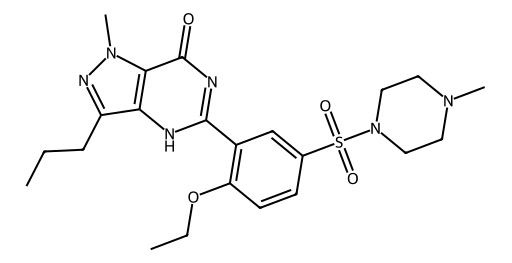

<!-- markdownlint-disable MD025 MD033 MD060 -->
# 西地那非（Viagra）

- [返回首页](../README.md)
- 另请参阅：[PDE5抑制剂对比](../../Hormonal_Balance_Compendium/Vitality_Source_Notes/PDE5_Compress.md)
- [1. 常见别名、物理性质、CAS编号、溶解度](#1-常见别名物理性质cas编号溶解度)
- [2. 化学性质、光热稳定性](#2-化学性质光热稳定性)
- [3. 生化特性](#3-生化特性)
- [4. 适应症、药理毒理](#4-适应症药理毒理)
- [5. 药代动力学、起效时间](#5-药代动力学起效时间)
- [6. 常见剂量、给药方式](#6-常见剂量给药方式)
- [7. 副作用、药物过量](#7-副作用药物过量)
- [8. 同分异构体与类似物](#8-同分异构体与类似物)
- [9. 在人体内整体作用](#9-在人体内整体作用)
- [10. 内分泌相关激素](#10-内分泌相关激素)
- [11. 对脂肪代谢](#11-对脂肪代谢)
- [12. 对血压的作用](#12-对血压的作用)
- [13. 对消化系统（急性）](#13-对消化系统急性)
- [14. 对神经系统的调节](#14-对神经系统的调节)
- [15. 对生殖系统](#15-对生殖系统)
- [16. 对皮肤的作用](#16-对皮肤的作用)
- [17. 过多或不足时的治疗](#17-过多或不足时的治疗)
- [18. 中医八纲辨证与五行归经](#18-中医八纲辨证与五行归经)

## 1. 常见别名、物理性质、CAS编号、溶解度

- 常见别名：万艾可、伟哥、Viagra
- 化学名称：1-[[3-(6,7-二氢-1-甲基-7-氧代-3-丙基-1H-吡唑并[4,3-d]嘧啶-5-基)-4-乙氧基苯基]磺酰]-4-甲基哌嗪
- CAS编号：139755-83-2
- 分子式：C₂₂H₃₀N₆O₄S
- 分子量：474.58
- 白色至类白色结晶粉末
- 微溶于水（约3.5 mg/mL），在酸性条件下溶解度增加
- 易溶于有机溶剂（甲醇、DMSO）
- pKa≈6.8（弱碱性）

## 2. 化学性质、光热稳定性

- 属于选择性PDE5抑制剂
- 对光较稳定，但长期暴露可能轻度降解
- 对热较稳定（常规储存条件）
- 在强酸/强碱条件下可发生降解（磺酰胺键水解）

## 3. 生化特性

- 靶点：磷酸二酯酶5（PDE5）
- 作用：抑制cGMP降解 → 平滑肌松弛
- NO–cGMP通路增强
- 对PDE6（视网膜）有轻度抑制（视觉副作用来源）

## 4. 适应症、药理毒理

- 适应症
  - 勃起功能障碍（ED）
  - 肺动脉高压（PAH）
- 药理作用
  - 阴茎海绵体血流增加
  - 肺血管扩张
- 毒理
  - 高剂量可致严重低血压
- 与硝酸酯类联用可致致命性血压下降

## 5. 药代动力学、起效时间

- 生物利用度：约40%
- Tmax：30–120分钟
- 起效时间：约30–60分钟
- 半衰期：3–5小时
- 代谢：肝脏（CYP3A4为主，CYP2C9次要）
- 排泄：粪便（主要），尿（少量）

## 6. 常见剂量、给药方式

- 常规剂量：50 mg（25–100 mg范围）
- 性活动前30–60分钟口服
- 每日最多1次

## 7. 副作用、药物过量

- 常见
  - 头痛
  - 面部潮红
  - 鼻塞
  - 消化不良
- 特异性
  - 蓝视（PDE6抑制）
  - 光敏感
- 严重
  - 低血压
  - 持续勃起（>4小时）
- 过量
  - 强化上述副作用
  - 需支持治疗

## 8. 同分异构体与类似物

- 他达拉非：半衰期长（17小时）
- 伐地那非：更高选择性
- 阿伐那非：起效更快

## 9. 在人体内整体作用

- 增强性刺激条件下的血管扩张
- 不直接诱导勃起（需性刺激）

## 10. 内分泌相关激素

- 对睾酮水平无直接显著影响
- 间接改善性功能 → 可能影响性激素轴

## 11. 对脂肪代谢

- 无直接作用
- 长期使用对代谢综合征有间接改善（通过血流改善）

## 12. 对血压的作用

- 轻度降低收缩压（约8–10 mmHg）
- 与降压药协同作用

## 13. 对消化系统（急性）

- 食物（尤其高脂）延迟吸收
- 可致胃部不适

## 14. 对神经系统的调节

- 通过NO–cGMP通路影响外周神经血流
- 中枢作用较弱
- 视觉异常：视网膜PDE6抑制

## 15. 对生殖系统

- 增强勃起能力
- 不直接增加性欲
- 不显著增加精液量

## 16. 对皮肤的作用

- 面部潮红
- 少数皮疹

## 17. 过多或不足时的治疗

- 过量
  - 停药
  - 支持治疗
  - 避免硝酸酯
- 疗效不足
  - 换用他达拉非
  - 联合心理/内分泌治疗
- 女性差异
  - 女性疗效不确定
  - 不作为常规用药

## 18. 中医八纲辨证与五行归经

- 八纲：偏阳虚夹瘀
- 五行：肾、肝
- 归经：肾经、肝经
- 中医作用理解
  - 温补肾阳（间接）
  - 活血通络
